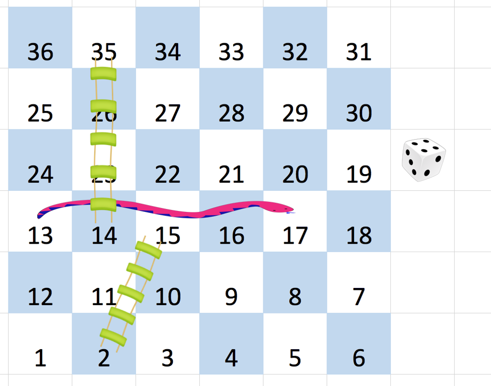

---
tags:
    - Array
    - Breadth-First Search
    - Matrix
    - Top Interviews
---


# [909. Snakes and Ladders](https://leetcode.com/problems/snakes-and-ladders/)

You are given an `n x n` integer matrix `board` where the cells are labeled from `1` to `n2` in a [**Boustrophedon style**](https://en.wikipedia.org/wiki/Boustrophedon) starting from the bottom left of the board (i.e. `board[n - 1][0]`) and alternating direction each row.

You start on square `1` of the board. In each move, starting from square `curr`, do the following:

- Choose a destination square `next` with a label in the range `[curr + 1, min(curr + 6, n2)]`.
  - This choice simulates the result of a standard **6-sided die roll**: i.e., there are always at most 6 destinations, regardless of the size of the board.
- If `next` has a snake or ladder, you **must** move to the destination of that snake or ladder. Otherwise, you move to `next`.
- The game ends when you reach the square `n2`.

A board square on row `r` and column `c` has a snake or ladder if `board[r][c] != -1`. The destination of that snake or ladder is `board[r][c]`. Squares `1` and `n2` are not the starting points of any snake or ladder.

Note that you only take a snake or ladder at most once per dice roll. If the destination to a snake or ladder is the start of another snake or ladder, you do **not** follow the subsequent snake or ladder.

- For example, suppose the board is `[[-1,4],[-1,3]]`, and on the first move, your destination square is `2`. You follow the ladder to square `3`, but do **not** follow the subsequent ladder to `4`.

Return *the least number of dice rolls required to reach the square* `n2`*. If it is not possible to reach the square, return* `-1`.

 

**Example 1:**



```
Input: board = [[-1,-1,-1,-1,-1,-1],[-1,-1,-1,-1,-1,-1],[-1,-1,-1,-1,-1,-1],[-1,35,-1,-1,13,-1],[-1,-1,-1,-1,-1,-1],[-1,15,-1,-1,-1,-1]]
Output: 4
Explanation: 
In the beginning, you start at square 1 (at row 5, column 0).
You decide to move to square 2 and must take the ladder to square 15.
You then decide to move to square 17 and must take the snake to square 13.
You then decide to move to square 14 and must take the ladder to square 35.
You then decide to move to square 36, ending the game.
This is the lowest possible number of moves to reach the last square, so return 4.
```

**Example 2:**

```
Input: board = [[-1,-1],[-1,3]]
Output: 1
```

 

**Constraints:**

- `n == board.length == board[i].length`
- `2 <= n <= 20`
- `board[i][j]` is either `-1` or in the range `[1, n2]`.
- The squares labeled `1` and `n2` are not the starting points of any snake or ladder.


**Solution:**

如何把编号y转成行号r和列号c?

先确定行号r, 再确定列号c.

把编号减一可以看得更清楚, 比如示例1:

* n = 6
* 编号$[0, 5]$ 在倒数$0$行
* 编号$[6, 11]$在倒数$1$行
* 编号$[12, 17]$在倒数$2$行
* ......

一般地, $y - 1$在倒数$y'=\left \lfloor \frac{y - 1}{n} \right \rfloor$行, 即正数$r= n -1 -r'$行.

在$y-1$下面有完整的$r'$行, 所有在$r'$行还剩下$c′=y−1−r′⋅n=(y−1)\mod n$:

* 如果$r'$是偶数, 那么列号$c=c'$.
* 如果$r'$是奇数, 那么列号$c = n - 1 - c'$.

```java
class Solution {
    public int snakesAndLadders(int[][] board) {
        if (board == null || board.length == 0){
            return 0;
        }

        int n = board.length;

        boolean[] visited = new boolean[n * n + 1];
        Deque<Integer> queue = new ArrayDeque<>();

        queue.offerLast(1); // bfs队列，初始状态从格子1开始

      	//表示当前是第几轮bfs，即走了多少步(投骰次数)
        int result = 0; 
	
        while(!queue.isEmpty()){
            int size = queue.size();
            for (int i = 0; i < size; i++){
                int cur = queue.pollFirst();
                if (cur == n * n){
                    return result; // 已到达终点
                }	
              
								// 可以走1~6步
                for (int y = cur + 1; y <= Math.min(cur + 6, n * n); y++){
                    // 计算棋盘中对应的二维坐标
                    int row = (y - 1) / n;
                    int col = (y - 1) % n;
										
                   // 棋盘是“之”字形编号：偶数行正常，奇数行反向
                    if (row % 2 > 0){
                        col = n - 1 - col; // 奇数行从右到左
                    }

                  //  // 实际位置可能是蛇、梯子终点
                    int nxt = board[n - 1 - row][col];
                    if (nxt < 0){
                        nxt = y; // // 没有梯子，就走到自己
                    }

                    if (!visited[nxt]){
                        visited[nxt] = true; // 有环的情况下, 避免死循环
                        queue.offerLast(nxt);
                    }

                }
            }
            result++;

        }

        return -1; // 无法到达终点
    }
}

// TC: O(n)
// SC: O(n)
```


❌: 这样写y循环给改掉了 

```

                    if (nxt >= 0){
                        y = nxt;
                    }

                    if (visited[y] != true){
                        visited[y] = true;
                        queue.offerLast(y);
                    }
```

