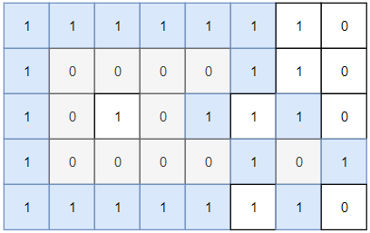
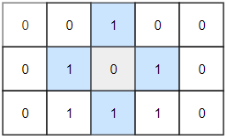

---
tags:
    - Array
    - Depth-First Search
    - Breadth-First Search
    - Union Find
    - Matrix
    - Top Interviews
---

# [1254. Number of Closed Islands](https://leetcode.com/problems/number-of-closed-islands/)

Given a 2D `grid` consists of `0s` (land) and `1s` (water). An *island* is a maximal 4-directionally connected group of `0s` and a *closed island* is an island **totally** (all left, top, right, bottom) surrounded by `1s.`

Return the number of *closed islands*.

 

**Example 1:**



```
Input: grid = [[1,1,1,1,1,1,1,0],[1,0,0,0,0,1,1,0],[1,0,1,0,1,1,1,0],[1,0,0,0,0,1,0,1],[1,1,1,1,1,1,1,0]]
Output: 2
Explanation: 
Islands in gray are closed because they are completely surrounded by water (group of 1s).
```

**Example 2:**



```
Input: grid = [[0,0,1,0,0],[0,1,0,1,0],[0,1,1,1,0]]
Output: 1
```

**Example 3:**

```
Input: grid = [[1,1,1,1,1,1,1],
               [1,0,0,0,0,0,1],
               [1,0,1,1,1,0,1],
               [1,0,1,0,1,0,1],
               [1,0,1,1,1,0,1],
               [1,0,0,0,0,0,1],
               [1,1,1,1,1,1,1]]
Output: 2
```

 

**Constraints:**

- `1 <= grid.length, grid[0].length <= 100`
- `0 <= grid[i][j] <=1`


**Solution:**

```java
class Solution {
    public int closedIsland(int[][] grid) {
        int n = grid.length;
        int m = grid[0].length;

        boolean[][] visited = new boolean[n][m];

        int result = 0;

        for (int i = 0; i < n; i++){
            for (int j = 0; j < m; j++){
                if (grid[i][j] == 0 && visited[i][j] == false && dfs(i, j, grid, visited) == true){
                    result++; 
                }
            }
        }

        return result;
    }

    private boolean dfs(int x, int y, int[][] grid, boolean[][] visited){
        if (x < 0 || x >= grid.length || y < 0 || y >= grid[0].length){
            return false;
        }

        if (grid[x][y] == 1 || visited[x][y]){
            return true;
        }


        visited[x][y] = true;

        boolean up = dfs(x + 1, y, grid, visited);
        boolean down = dfs(x - 1, y, grid, visited);
        boolean right = dfs(x, y + 1, grid, visited);
        boolean left = dfs(x, y - 1, grid, visited);

        if (up && down && right && left){
            return true;
        }

        return false;

    }
}
```


```java
class Solution {
    int[][] dirs = {{0,1}, {1,0}, {-1,0},{0,-1}};
    public int closedIsland(int[][] grid) {
        int n = grid.length;
        int m = grid[0].length;

        boolean[][] visit = new boolean[n][m];

        int count = 0;
        for (int i = 0; i < n; i++){
            for (int j = 0; j < m; j++){
                if (grid[i][j] == 0 && !visit[i][j] && dfs(i, j, m, n, grid, visit)){
                    count++;
                }
            }
        }
        return count;
    }

    public boolean dfs(int x, int y, int m, int n, int[][] grid, boolean[][] visit){
        if (x < 0 || x >= grid.length || y < 0 || y >= grid[0].length){
            return false;
        }

        if (grid[x][y] == 1 || visit[x][y]){
            return true;
        }

        visit[x][y] = true;
        boolean isClosed = true;

        for (int[] dir : dirs){
            int newX = x + dir[0];
            int newY = y + dir[1];

            if (!dfs(newX, newY, m, n, grid, visit)){
                isClosed = false;
            }
        }

        return isClosed;
    
    }
}
```

