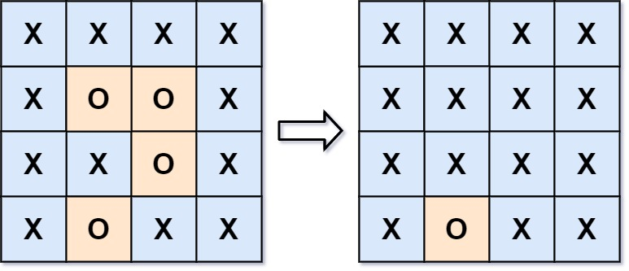

# [130. Surrounded Regions](https://leetcode.com/problems/surrounded-regions/)

You are given an `m x n` matrix `board` containing **letters** `'X'` and `'O'`, **capture regions** that are **surrounded**:

- **Connect**: A cell is connected to adjacent cells horizontally or vertically.
- **Region**: To form a region **connect every** `'O'` cell.
- **Surround**: The region is surrounded with `'X'` cells if you can **connect the region** with `'X'` cells and none of the region cells are on the edge of the `board`.

A **surrounded region is captured** by replacing all `'O'`s with `'X'`s in the input matrix `board`.

 

**Example 1:**

**Input:** board = [["X","X","X","X"],["X","O","O","X"],["X","X","O","X"],["X","O","X","X"]]

**Output:** [["X","X","X","X"],["X","X","X","X"],["X","X","X","X"],["X","O","X","X"]]

**Explanation:**



In the above diagram, the bottom region is not captured because it is on the edge of the board and cannot be surrounded.

**Example 2:**

**Input:** board = [["X"]]

**Output:** [["X"]]

 

**Constraints:**

- `m == board.length`
- `n == board[i].length`
- `1 <= m, n <= 200`
- `board[i][j]` is `'X'` or `'O'`.


**Solution:**

DFS:

```java
class Solution {
    public void solve(char[][] board) {
        int m = board.length;
        int n = board[0].length;
        if (m < 1 || n < 1){
            return;
        }
        // Mark 'O' cells on the borders and initiate DFS from them
        for (int i = 0; i < m; i++){ 
            if (board[i][0] == 'O'){
                dfs(i, 0, board); 
            }

            if (board[i][n - 1] == 'O'){
                dfs(i, n - 1, board);
            }
        }

        for (int j = 0; j < n; j++){
            if (board[0][j] == 'O'){
                dfs(0, j, board);
            }

            if (board[m - 1][j] == 'O'){
                dfs(m - 1, j, board);
            }
        }


        // Convert remaining 'O' cells to 'X', and revert marked cells back to 'O'
        for (int i = 0; i < m; i++){
            for (int j = 0; j < n; j++){
                if (board[i][j] == 'O'){
                    board[i][j] = 'X';
                }else if (board[i][j] == '1'){
                    board[i][j] = 'O';
                }
            }
        }

        return;
    }

    private void dfs(int x, int y, char[][] board){
        // Out of bounds check
        if (x < 0 || y < 0 || x == board.length || y == board[0].length || board[x][y] != 'O'){
            return;
        }

        board[x][y] = '1'; // Mark current 'O' cell as visited

        // DFS in all four directions
        dfs(x+1, y, board);
        dfs(x -1, y, board);
        dfs(x, y + 1, board);
        dfs(x, y - 1, board);
    }
}

// TC: O(m * n)
// SC: O(m * n)
```


```java
class Solution {
    public void solve(char[][] board) {
        int row = board.length;
        int col = board[0].length;
        
        // Mark 'O' cells on the borders and initiate DFS from them
        for (int i = 0; i < row; i++){
            if (board[i][0] == 'O'){
                dfs(board, i, 0);
            }

            if (board[i][col - 1] == 'O'){
                dfs(board, i, col - 1);
            }
        }

        for (int j = 0; j < col; j++){
            if (board[0][j] == 'O'){
                dfs(board, 0, j);
            }

            if (board[row - 1][j] == 'O'){
                dfs(board, row - 1, j);
            }
        }
        // Convert remaining 'O' cells to 'X', and revert marked cells back to 'O'
        for (int i = 0; i < row; i++){
            for (int j = 0; j < col; j++){
                if (board[i][j] == 'O'){
                    board[i][j] = 'X';
                } else if (board[i][j] == '1'){
                    board[i][j] = 'O';
                }
            }
        }
        
    }

    private void dfs(char[][] board, int i, int j){
        // Out of bounds check
        if (i < 0 || i >= board.length || j < 0 || j >= board[0].length || board[i][j] != 'O'){
            return;
        }

        board[i][j] = '1'; // Mark current 'O' cell as visited

        // DFS in all four directions
        dfs(board, i, j - 1); // left
        dfs(board, i - 1, j); // up
        dfs(board, i, j + 1); // right
        dfs(board, i + 1, j); // down
    }
}
```

