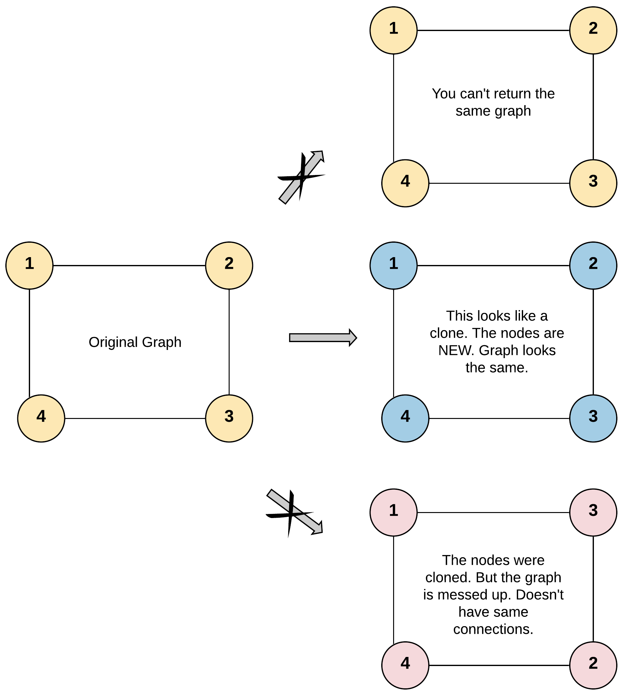
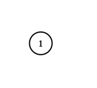

---
tags:
    - Hash Table
    - Depth-First Search
    - Breadth-First Search
    - Graph
    - Top Interviews
---

# [133. Clone Graph](https://leetcode.com/problems/clone-graph/)

Given a reference of a node in a **[connected](https://en.wikipedia.org/wiki/Connectivity_(graph_theory)#Connected_graph)** undirected graph.

Return a [**deep copy**](https://en.wikipedia.org/wiki/Object_copying#Deep_copy) (clone) of the graph.

Each node in the graph contains a value (`int`) and a list (`List[Node]`) of its neighbors.

```
class Node {
    public int val;
    public List<Node> neighbors;
}
```

 

**Test case format:**

For simplicity, each node's value is the same as the node's index (1-indexed). For example, the first node with `val == 1`, the second node with `val == 2`, and so on. The graph is represented in the test case using an adjacency list.

**An adjacency list** is a collection of unordered **lists** used to represent a finite graph. Each list describes the set of neighbors of a node in the graph.

The given node will always be the first node with `val = 1`. You must return the **copy of the given node** as a reference to the cloned graph.

 

**Example 1:**



```
Input: adjList = [[2,4],[1,3],[2,4],[1,3]]
Output: [[2,4],[1,3],[2,4],[1,3]]
Explanation: There are 4 nodes in the graph.
1st node (val = 1)'s neighbors are 2nd node (val = 2) and 4th node (val = 4).
2nd node (val = 2)'s neighbors are 1st node (val = 1) and 3rd node (val = 3).
3rd node (val = 3)'s neighbors are 2nd node (val = 2) and 4th node (val = 4).
4th node (val = 4)'s neighbors are 1st node (val = 1) and 3rd node (val = 3).
```

**Example 2:**



```
Input: adjList = [[]]
Output: [[]]
Explanation: Note that the input contains one empty list. The graph consists of only one node with val = 1 and it does not have any neighbors.
```

**Example 3:**

```
Input: adjList = []
Output: []
Explanation: This an empty graph, it does not have any nodes.
```

 

**Solution:**

### DFS

```java
/*
// Definition for a Node.
class Node {
    public int val;
    public List<Node> neighbors;
    public Node() {
        val = 0;
        neighbors = new ArrayList<Node>();
    }
    public Node(int _val) {
        val = _val;
        neighbors = new ArrayList<Node>();
    }
    public Node(int _val, ArrayList<Node> _neighbors) {
        val = _val;
        neighbors = _neighbors;
    }
}
*/

class Solution {
    public Node cloneGraph(Node node) {
        if (node == null){
            return null;
        }

        Map<Node, Node> map = new HashMap<>();

        Node result = dfs(node, map);
        return result;
    }

    private Node dfs(Node node, Map<Node, Node> map){
        Node newNode = new Node(node.val);
        map.put(node, newNode);

        for (Node n : node.neighbors){
            if (!map.containsKey(n)){
                newNode.neighbors.add(dfs(n , map));
            }else{
                newNode.neighbors.add(map.get(n));
            }

        }
        return newNode;
    }


}
// TC: O(V + E)
// SC: O(V)
```


This is a connected graph, so we can use the following way, if not we have to add whole nodes first.

```java
/*
// Definition for a Node.
class Node {
    public int val;
    public List<Node> neighbors;
    public Node() {
        val = 0;
        neighbors = new ArrayList<Node>();
    }
    public Node(int _val) {
        val = _val;
        neighbors = new ArrayList<Node>();
    }
    public Node(int _val, ArrayList<Node> _neighbors) {
        val = _val;
        neighbors = _neighbors;
    }
}
*/

class Solution {
    Map<Node,Node> map = new HashMap<Node, Node>();
    public Node cloneGraph(Node node) {
        if (node == null){
            return null;
        }

        if (map.containsKey(node)){
            return map.get(node);
        }
        
        Node clone = new Node(node.val, new ArrayList<Node>());

        map.put(node, clone);

        for (Node neighbor : node.neighbors){
            clone.neighbors.add(cloneGraph(neighbor));
        }
        return clone;
    }
}

// TC:O(n)
// sC:O(n)
```


### BFS

```java
/*
// Definition for a Node.
class Node {
    public int val;
    public List<Node> neighbors;
    public Node() {
        val = 0;
        neighbors = new ArrayList<Node>();
    }
    public Node(int _val) {
        val = _val;
        neighbors = new ArrayList<Node>();
    }
    public Node(int _val, ArrayList<Node> _neighbors) {
        val = _val;
        neighbors = _neighbors;
    }
}
*/

class Solution {
    public Node cloneGraph(Node node) {
        if (node == null){
            return node;
        }


        Map<Node, Node> visited = new HashMap();
        
        Deque<Node> queue = new ArrayDeque<>();
        queue.offerLast(node);
        visited.put(node, new Node(node.val, new ArrayList<>()));

        while(!queue.isEmpty()){
            int size = queue.size();
            Node cur = queue.pollFirst();

            for (Node nei : cur.neighbors){
                if (!visited.containsKey(nei)){
                    visited.put(nei, new Node(nei.val, new ArrayList<>()));
                    queue.offerLast(nei);
                }

                visited.get(cur).neighbors.add(visited.get(nei));
            }
        }

        return visited.get(node);


    }
}
```


```java
class Solution {
    public Node cloneGraph(Node node) {
        if (node == null) {
            return node;
        }

        HashMap<Node, Node> visited = new HashMap();

        // 将题目给定的节点添加到队列
        LinkedList<Node> queue = new LinkedList<Node> ();
        queue.add(node);
        // 克隆第一个节点并存储到哈希表中
        visited.put(node, new Node(node.val, new ArrayList()));

        // 广度优先搜索
        while (!queue.isEmpty()) {
            // 取出队列的头节点
            Node n = queue.remove();
            // 遍历该节点的邻居
            for (Node neighbor: n.neighbors) {
                if (!visited.containsKey(neighbor)) {
                    // 如果没有被访问过，就克隆并存储在哈希表中
                    visited.put(neighbor, new Node(neighbor.val, new ArrayList()));
                    // 将邻居节点加入队列中
                    queue.add(neighbor);
                }
                // 更新当前节点的邻居列表
                visited.get(n).neighbors.add(visited.get(neighbor));
            }
        }

        return visited.get(node);
    }
}

```

