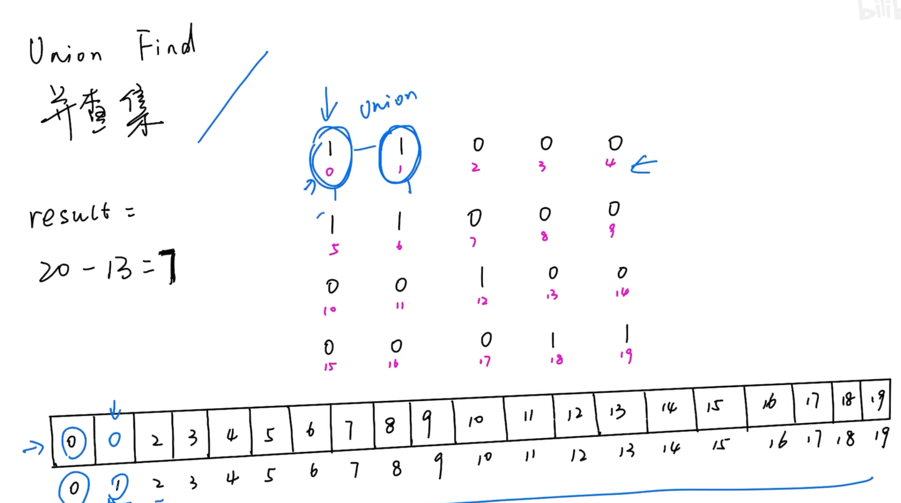
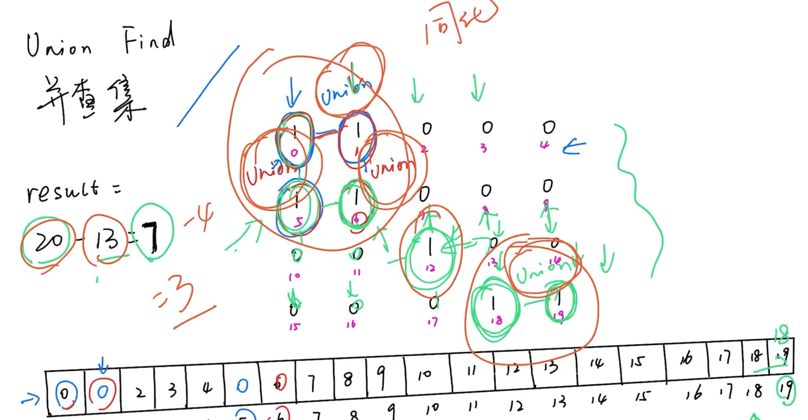

---
tags:
    - Array	
    - Depth-First Search
    - Breadth-First Search
    - Union Find
    - Matrix
    - Top Interview 150
---

# [200. Number of Islands](https://leetcode.com/problems/number-of-islands/)

Given an `m x n` 2D binary grid `grid` which represents a map of `'1'`s (land) and `'0'`s (water), return *the number of islands*.

An **island** is surrounded by water and is formed by connecting adjacent lands horizontally or vertically. You may assume all four edges of the grid are all surrounded by water.

 

**Example 1:**

```
Input: grid = [
  ["1","1","1","1","0"],
  ["1","1","0","1","0"],
  ["1","1","0","0","0"],
  ["0","0","0","0","0"]
]
Output: 1
```

**Example 2:**

```
Input: grid = [
  ["1","1","0","0","0"],
  ["1","1","0","0","0"],
  ["0","0","1","0","0"],
  ["0","0","0","1","1"]
]
Output: 3
```

 

**Constraints:**

- `m == grid.length`
- `n == grid[i].length`
- `1 <= m, n <= 300`
- `grid[i][j]` is `'0'` or `'1'`.


**Solution:**

### DFS

```java
class Solution {
    public int numIslands(char[][] grid) {
        int result = 0;
        for (int i = 0; i < grid.length; i++){
            for (int j = 0; j < grid[0].length; j++){
                if (grid[i][j] == '1') {
                    dfs(grid, i, j);
                    result++;
                }
            }
        }
        return result;
    }

    private void dfs(char[][] grid, int x, int y){
        if (x < 0 || x == grid.length || y < 0 || y == grid[0].length || grid[x][y] == '0'){
            return;
        }

        grid[x][y] = '0';

        dfs(grid, x + 1, y);
        dfs(grid, x - 1, y);
        dfs(grid, x, y + 1);
        dfs(grid, x, y - 1);
    }
}
// TC: O(nm)
// SC: O(nm)
```


```java
class Solution {
    public int numIslands(char[][] grid) {
        int result = 0;
        for (int i = 0; i < grid.length; i++){
            for (int j = 0; j < grid[0].length; j++){
                if (grid[i][j] == '1'){
                    result = result + 1;
                    helper(grid, i, j);
                }
            }
        }

        return result;
    }

    private void helper(char[][] grid, int x, int y){
        if (x < 0 || x == grid.length || y < 0 || y == grid[0].length || grid[x][y] == '0'){
            return;
        }


        if (grid[x][y] == '1'){
            grid[x][y] = '0';
        }

        helper(grid, x + 1, y);
        helper(grid, x - 1, y);
        helper(grid, x, y + 1);
        helper(grid, x, y - 1);
    }
}

// TC: O(level) = O(n *m )

// SC: O(n*m)
```


```java
class Solution {
    public int numIslands(char[][] grid) {
        // base case 
        if (grid == null || grid.length == 0 || grid[0].length == 0){
            return 0;
        }

        int row = grid.length;
        int col = grid[0].length;

        int[][] visited = new int[row][col]; // 0 false 1 true

        int result = 0;

        for (int i = 0; i < row; i++){
            for (int j = 0; j < col; j++){
                if (grid[i][j] == '1' && visited[i][j] == 0){
                    result++;
                    dfs(grid, i, j, visited); // 
                }
            }
        }

        return result;
    }

    private void dfs(char[][] grid, int x, int y, int[][] visited){
        int row = grid.length;
        int col = grid[0].length;

        if (x < 0 || x >= row || y < 0 || y >= col || grid[x][y] == '0' || visited[x][y] == 1){
            return;
        }

        visited[x][y] = 1;

        dfs(grid, x + 1, y, visited);
        dfs(grid, x-1, y, visited);
        dfs(grid, x, y+1, visited);
        dfs(grid, x, y-1, visited);
    }
}


// TC: O(m*n)
// SC: O(m*n)
```


### BFS

```java
class Solution {
    int[][] dirs = {{0,1}, {0,-1},{1,0},{-1,0}};
    public int numIslands(char[][] grid) {
        // bfs
        // queue

        /*
                1
                /\
                1 1

        */

        int result = 0;
        int n = grid.length;
        int m = grid[0].length;

        int[][] visited = new int[n][m];

        for (int i = 0; i < n; i++){
            for (int j = 0; j < m; j++){
                if (grid[i][j] == '1' && visited[i][j] == 0){
                    result++;
                    bfs(i, j, visited, grid);
                }
            }
        }
        
        return result;

    }

    private void bfs(int x, int y, int[][] visited, char[][] grid){
        int n = grid.length;
        int m = grid[0].length;

        Deque<int[]> queue = new ArrayDeque<>();

        visited[x][y] = 1;

        queue.offerLast(new int[]{x,y});
        grid[x][y] = '0';
        while(!queue.isEmpty()){
            int[] cur = queue.pollFirst();
            int i = cur[0];
            int j = cur[1];
            for (int[] dir : dirs){
                int newX = i + dir[0];
                int newY = j + dir[1];
                if (newX >= 0 && newX < n && newY >= 0 && newY < m && grid[newX][newY] == '1' && visited[newX][newY] == 0){
                    visited[newX][newY] = 1;
                    queue.add(new int[]{newX, newY});
                }
            }

        }

    }
}
```


### UnionFind





> https://www.bilibili.com/video/BV1Tr4y1K7bA/?spm_id_from=333.337.search-card.all.click&vd_source=73e7d2c4251a7c9000b22d21b70f5635

```java
class Solution {
    static class UnionFind{
        int count;
        int[] root;
        int[] rank;

        public UnionFind(char[][] grid){
            int rows = grid.length;
            int cols = grid[0].length;
            root = new int[rows * cols];
            rank = new int[rows * cols];
            count = 0;

            for(int r = 0; r < rows; r++){
                for (int c = 0; c < cols; c++){
                    if (grid[r][c] == '1'){
                        int id = r * cols + c;
                        root[id] = id;
                        rank[id] = 1;
                        count++;
                    }
                }
            }
        }

        public int find(int x){
            if (root[x] != x){
                root[x] = find(root[x]);
            }

            return root[x];
        }

        public void union(int x, int y){
            int rootX = find(x);
            int rootY = find(y);

            if (rootX != rootY){
                count--;
                // Reduced island count when two lands are connected

                if (rank[rootX] > rank[rootY]){
                    root[rootY] = rootX;
                }else if (rank[rootX] < rank[rootY]){
                    root[rootX] = rootY;
                }else{
                    root[rootX] = rootY;
                    rank[rootY] = rank[rootY] + 1; 
                }
            }
        }

        public int getCount(){
            return count;
        }
    }

    public int numIslands(char[][] grid) {
        if (grid == null || grid.length == 0){
            return 0;
        }


        int rows = grid.length;
        int cols = grid[0].length;
        UnionFind uf = new UnionFind(grid);

        int[][] directions = {{-1, 0}, {1, 0}, {0, -1}, {0, 1}};

        for (int r = 0; r < rows; r++){
            for (int c = 0; c < cols; c++){
                if (grid[r][c] == '1'){
                    int id = r * cols + c;
                    for (int[] dir : directions){
                        int newR = r + dir[0];
                        int newC = c + dir[1];

                        if (newR >= 0 && newR < rows && newC >= 0 && newC < cols && grid[newR][newC]== '1'){
                            int neighborId = newR * cols + newC;
                            uf.union(id, neighborId);
                        }
                    }
                }
            }
        }

        return uf.getCount();
    }
}
```


```java
class Solution {
    static class UnionFind {
        int count; // Number of islands
        int[] root; // Parent of each node
        int[] rank; // Rank to keep tree flat

        public UnionFind(char[][] grid) {
            int rows = grid.length;
            int cols = grid[0].length;
            root = new int[rows * cols];
            rank = new int[rows * cols];
            count = 0;

            // Initialize UnionFind structure
            for (int r = 0; r < rows; r++) {
                for (int c = 0; c < cols; c++) {
                    if (grid[r][c] == '1') {
                        int id = r * cols + c;
                        root[id] = id; // Initially, each node is its own root
                        rank[id] = 1;  // Rank starts at 1
                        count++;       // Count each land piece as an island initially
                    }
                }
            }
        }

        public int find(int x) {
            if (root[x] != x) {
                root[x] = find(root[x]); // Path compression
            }
            return root[x];
        }

        public void union(int x, int y) {
            int rootX = find(x);
            int rootY = find(y);

            if (rootX != rootY) {
                // Union by rank
                if (rank[rootX] > rank[rootY]) {
                    root[rootY] = rootX;
                } else if (rank[rootX] < rank[rootY]) {
                    root[rootX] = rootY;
                } else {
                    root[rootY] = rootX;
                    rank[rootX] += 1;
                }
                count--; // Reduce island count when two lands are connected
            }
        }

        public int getCount() {
            return count;
        }
    }

    public int numIslands(char[][] grid) {
        if (grid == null || grid.length == 0) return 0;

        int rows = grid.length;
        int cols = grid[0].length;
        UnionFind uf = new UnionFind(grid);

        // Directions for the 4-connected neighbors (up, down, left, right)
        int[][] directions = {{-1, 0}, {1, 0}, {0, -1}, {0, 1}};

        for (int r = 0; r < rows; r++) {
            for (int c = 0; c < cols; c++) {
                if (grid[r][c] == '1') {
                    int currentId = r * cols + c;
                    for (int[] direction : directions) {
                        int nr = r + direction[0];
                        int nc = c + direction[1];
                        // Check boundaries and whether it's land ('1')
                        if (nr >= 0 && nr < rows && nc >= 0 && nc < cols && grid[nr][nc] == '1') {
                            int neighborId = nr * cols + nc;
                            uf.union(currentId, neighborId);
                        }
                    }
                }
            }
        }

        return uf.getCount();
    }
}

```

```java
class Solution {
    static class UnionFind {
        int count; // Number of islands
        int[] root; // Parent of each node
        int[] rank; // Rank to keep tree flat

        public UnionFind(char[][] grid) {
            int rows = grid.length;
            int cols = grid[0].length;
            root = new int[rows * cols];
            rank = new int[rows * cols];
            count = 0;

            // Initialize UnionFind structure
            for (int r = 0; r < rows; r++) {
                for (int c = 0; c < cols; c++) {
                    if (grid[r][c] == '1') {
                        int id = r * cols + c;
                        root[id] = id; // Initially, each node is its own root
                        rank[id] = 1;  // Rank starts at 1
                        count++;       // Count each land piece as an island initially
                    }
                }
            }
        }

        public int find(int x) {
            if (root[x] != x) {
                root[x] = find(root[x]); // Path compression
            }
            return root[x];
        }

        public void union(int x, int y) {
            int rootX = find(x);
            int rootY = find(y);

            if (rootX != rootY) {
                // Union by rank
                if (rank[rootX] > rank[rootY]) {
                    root[rootY] = rootX;
                } else if (rank[rootX] < rank[rootY]) {
                    root[rootX] = rootY;
                } else {
                    root[rootY] = rootX;
                    rank[rootX] += 1;
                }
                count--; // Reduce island count when two lands are connected
            }
        }

        public int getCount() {
            return count;
        }
    }

    public int numIslands(char[][] grid) {
        if (grid == null || grid.length == 0) return 0;

        int rows = grid.length;
        int cols = grid[0].length;
        UnionFind uf = new UnionFind(grid);

        // Directions for the 4-connected neighbors (up, down, left, right)
        int[][] directions = {{-1, 0}, {1, 0}, {0, -1}, {0, 1}};

        for (int r = 0; r < rows; r++) {
            for (int c = 0; c < cols; c++) {
                if (grid[r][c] == '1') {
                    int currentId = r * cols + c;
                    for (int[] direction : directions) {
                        int nr = r + direction[0];
                        int nc = c + direction[1];
                        // Check boundaries and whether it's land ('1')
                        if (nr >= 0 && nr < rows && nc >= 0 && nc < cols && grid[nr][nc] == '1') {
                            int neighborId = nr * cols + nc;
                            uf.union(currentId, neighborId);
                        }
                    }
                }
            }
        }

        return uf.getCount();
    }
}

```


https://leetcode.cn/problems/number-of-islands/solutions/2965773/ba-fang-wen-guo-de-ge-zi-cha-shang-qi-zi-9gs0/
