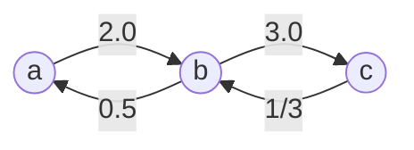

# [399. Evaluate Division](https://leetcode.com/problems/evaluate-division/)

You are given an array of variable pairs `equations` and an array of real numbers `values`, where `equations[i] = [Ai, Bi]` and `values[i]` represent the equation `Ai / Bi = values[i]`. Each `Ai` or `Bi` is a string that represents a single variable.

You are also given some `queries`, where `queries[j] = [Cj, Dj]` represents the `jth` query where you must find the answer for `Cj / Dj = ?`.

Return *the answers to all queries*. If a single answer cannot be determined, return `-1.0`.

**Note:** The input is always valid. You may assume that evaluating the queries will not result in division by zero and that there is no contradiction.

**Note:** The variables that do not occur in the list of equations are undefined, so the answer cannot be determined for them.

 

**Example 1:**

```
Input: equations = [["a","b"],["b","c"]], values = [2.0,3.0], queries = [["a","c"],["b","a"],["a","e"],["a","a"],["x","x"]]
Output: [6.00000,0.50000,-1.00000,1.00000,-1.00000]
Explanation: 
Given: a / b = 2.0, b / c = 3.0
queries are: a / c = ?, b / a = ?, a / e = ?, a / a = ?, x / x = ? 
return: [6.0, 0.5, -1.0, 1.0, -1.0 ]
note: x is undefined => -1.0
```

**Example 2:**

```
Input: equations = [["a","b"],["b","c"],["bc","cd"]], values = [1.5,2.5,5.0], queries = [["a","c"],["c","b"],["bc","cd"],["cd","bc"]]
Output: [3.75000,0.40000,5.00000,0.20000]
```

**Example 3:**

```
Input: equations = [["a","b"]], values = [0.5], queries = [["a","b"],["b","a"],["a","c"],["x","y"]]
Output: [0.50000,2.00000,-1.00000,-1.00000]
```

 

**Constraints:**

- `1 <= equations.length <= 20`
- `equations[i].length == 2`
- `1 <= Ai.length, Bi.length <= 5`
- `values.length == equations.length`
- `0.0 < values[i] <= 20.0`
- `1 <= queries.length <= 20`
- `queries[i].length == 2`
- `1 <= Cj.length, Dj.length <= 5`
- `Ai, Bi, Cj, Dj` consist of lower case English letters and digits.


**Solution:**

### DFS

```java
class Solution {
    public double[] calcEquation(List<List<String>> equations, double[] values, List<List<String>> queries) {
        Map<String, Map<String, Double>> graph = buildGraph(equations, values);
        double[] result = new double[queries.size()];
        for (int i = 0; i < queries.size(); i++){
            List<String> query = queries.get(i);

            String dividend = query.get(0);

            String divisor = query.get(1);

            if (!graph.containsKey(dividend) || !graph.containsKey(divisor)){
                result[i] = -1.0;
            }else if (dividend == divisor){
                result[i] = 1.0;
            }else{
                Set<String> visited = new HashSet<String>();

                result[i] = dfs(graph, dividend, divisor, 1.0, visited);
            }
        }

        return result;

    }

    public Map<String, Map<String, Double>> buildGraph(List<List<String>> equations, double[] values){

        Map<String, Map<String, Double>> graph = new HashMap<>();

        for (int i = 0; i < equations.size(); i++){
            List<String> equation = equations.get(i);

            String dividend = equation.get(0);
            String divisor = equation.get(1);

            double quotient = values[i];

            if (!graph.containsKey(dividend)){
                graph.put(dividend, new HashMap<String, Double>());
            }

            if (!graph.containsKey(divisor)){
                graph.put(divisor, new HashMap<String, Double>());
            }

            graph.get(dividend).put(divisor, quotient);
            graph.get(divisor).put(dividend, 1.0 / quotient);
        }

        return graph;
    }

    public double dfs(Map<String, Map<String, Double>> graph, String current, String target, double curProduct, Set<String> visited){
        if (current.equals(target)){
            return curProduct;
        }

        visited.add(current);

        for (Map.Entry<String, Double> edge : graph.get(current).entrySet()){
            String nextNode = edge.getKey();
            double edgeValue = edge.getValue();

            if (visited.contains(nextNode)){
                continue;
            }

            double result = dfs(graph, nextNode, target, curProduct * edgeValue, visited);

            if (result != -1.0){
                return result;
            }
        }

        return -1.0;
    }
}

// TC: O(Q × (V + E))
// SC: O(V + E)
```





----


```java
class Solution {
    public double[] calcEquation(List<List<String>> equations, double[] values, List<List<String>> queries) {
        // equations = [["a","b"],["b","c"]], 
        //               
        // values = [2.0,3.0], 
        // a/b=2    b/c = 3       a/c = a/b * b/c = 6
        // b/a = -1, a/e = 
    
        Map<String, Map<String, Double>> graph = new HashMap<>();
        // "a", < b, 2.0 >   a/b = 2.0
        // "b", < a, 0.5> <c, 3.0>  1/2 = b/a b/c =3.0
        // "c", < b , 1/3.0>     1/.3.0 = c /b  


        for (int i = 0; i < equations.size(); i++){
            List<String> equation = equations.get(i); // ["a", "b"], ["b", "c"]

            String dividend = equation.get(0);// 被除数 // "a", // "b"
            String divisor = equation.get(1); // "b" // "c"
            double quotient = values[i]; // 2.0 // 3.0

            if (!graph.containsKey(dividend)){
                graph.put(dividend, new HashMap<String, Double>());
            }

            if (!graph.containsKey(divisor)){
                graph.put(divisor, new HashMap<String, Double>());
            }

            graph.get(dividend).put(divisor, quotient); // 
            graph.get(divisor).put(dividend, 1 / quotient);

        }

        double[] results = new double[queries.size()];

        // queries = [["a","c"],["b","a"],["a","e"],["a","a"],["x","x"]]
        // results[6, 1, 2, 3, 4, 5]

        for (int i = 0; i < queries.size(); i++){
            List<String> query = queries.get(i); // [a, c]
            String dividend = query.get(0); // [a]
            String divisor = query.get(1); // [c]

            if (!graph.containsKey(dividend) || !graph.containsKey(divisor)){
                results[i] = -1.0; 
            }else if (dividend == divisor){
                results[i] = 1.0;
            }else{
                HashSet<String> visited = new HashSet<>();
                results[i] = backtrackEvaluate(graph, dividend, divisor, 1, visited);
                // a, c, 1, visited
            }
        }

        return results;
        
    }

            // "a", < b, 2.0 >   a/b = 2.0
            // "b", < a, 0.5> <c, 3.0>  1/2 = b/a b/c =3.0
            // "c", < b , 1/3.0>     1/.3.0 = c /b  
                       //       a, c, 1, visited
    private double backtrackEvaluate(Map<String, Map<String, Double>> graph, String currNode, String targetNode, double accProduct, Set<String> visited){
    // a, c, 1, visited
    //                 // backtrackEvaluate(graph, b, c, 1 * 2, visited)
        visited.add(currNode);  // b
        double ret = -1.0; // 

        Map<String,Double> neighbors = graph.get(currNode); // < a, 0.5> <c, 3.0>
        // graph.get(a) = <b, 2.0>
        // 
        if (neighbors.containsKey(targetNode)){ // <c,3.0>
            ret = accProduct * neighbors.get(targetNode); // 2 * 3.0 = 6
        }else{
            for (Map.Entry<String, Double> pair : neighbors.entrySet()){
                String nextNode = pair.getKey(); // <b>
                if (visited.contains(nextNode)){ // 
                    continue;
                }
                
                ret = backtrackEvaluate(graph, nextNode, targetNode, accProduct * pair.getValue(), visited);        
                // backtrackEvaluate(graph, b, c, 1 * 2, visited) // 6
                if (ret != -1.0){
                    break;
                }
            }
        }

        visited.remove(currNode); // remove(b) // remove(a)
        return ret;// 6 // 6
    }
}
```


```java
class Solution {
    public double[] calcEquation(List<List<String>> equations, double[] values,
            List<List<String>> queries) {

        HashMap<String, HashMap<String, Double>> graph = new HashMap<>();

        // Step 1). build the graph from the equations
        for (int i = 0; i < equations.size(); i++) {
            List<String> equation = equations.get(i);
            String dividend = equation.get(0), divisor = equation.get(1);
            double quotient = values[i];

            if (!graph.containsKey(dividend))
                graph.put(dividend, new HashMap<String, Double>());
            if (!graph.containsKey(divisor))
                graph.put(divisor, new HashMap<String, Double>());

            graph.get(dividend).put(divisor, quotient);
            graph.get(divisor).put(dividend, 1 / quotient);
        }

        // Step 2). Evaluate each query via bactracking (DFS)
        // by verifying if there exists a path from dividend to divisor
        double[] results = new double[queries.size()];
        for (int i = 0; i < queries.size(); i++) {
            List<String> query = queries.get(i);
            String dividend = query.get(0), divisor = query.get(1);

            if (!graph.containsKey(dividend) || !graph.containsKey(divisor))
                results[i] = -1.0;
            else if (dividend == divisor)
                results[i] = 1.0;
            else {
                HashSet<String> visited = new HashSet<>();
                results[i] = backtrackEvaluate(graph, dividend, divisor, 1, visited);
            }
        }

        return results;
    }

    private double backtrackEvaluate(HashMap<String, HashMap<String, Double>> graph, String currNode, String targetNode, double accProduct, Set<String> visited) {

        // mark the visit
        visited.add(currNode);
        double ret = -1.0;

        Map<String, Double> neighbors = graph.get(currNode);
        if (neighbors.containsKey(targetNode))
            ret = accProduct * neighbors.get(targetNode);
        else {
            for (Map.Entry<String, Double> pair : neighbors.entrySet()) {
                String nextNode = pair.getKey();
                if (visited.contains(nextNode))
                    continue;
                ret = backtrackEvaluate(graph, nextNode, targetNode,
                        accProduct * pair.getValue(), visited);
                if (ret != -1.0)
                    break;
            }
        }

        // unmark the visit, for the next backtracking
        visited.remove(currNode);
        return ret;
    }
}
```

> What the Question is talking about?


```java
class Solution {

    public double[] calcEquation(List<List<String>> equations, double[] values,
            List<List<String>> queries) {

        HashMap<String, Pair<String, Double>> gidWeight = new HashMap<>();

        // Step 1). build the union groups
        for (int i = 0; i < equations.size(); i++) {
            List<String> equation = equations.get(i);
            String dividend = equation.get(0), divisor = equation.get(1);
            double quotient = values[i];

            union(gidWeight, dividend, divisor, quotient);
        }

        // Step 2). run the evaluation, with "lazy" updates in find() function
        double[] results = new double[queries.size()];
        for (int i = 0; i < queries.size(); i++) {
            List<String> query = queries.get(i);
            String dividend = query.get(0), divisor = query.get(1);

            if (!gidWeight.containsKey(dividend) || !gidWeight.containsKey(divisor))
                // case 1). at least one variable did not appear before
                results[i] = -1.0;
            else {
                Pair<String, Double> dividendEntry = find(gidWeight, dividend);
                Pair<String, Double> divisorEntry = find(gidWeight, divisor);

                String dividendGid = dividendEntry.getKey();
                String divisorGid = divisorEntry.getKey();
                Double dividendWeight = dividendEntry.getValue();
                Double divisorWeight = divisorEntry.getValue();

                if (!dividendGid.equals(divisorGid))
                    // case 2). the variables do not belong to the same chain/group
                    results[i] = -1.0;
                else
                    // case 3). there is a chain/path between the variables
                    results[i] = dividendWeight / divisorWeight;
            }
        }

        return results;
    }

    private Pair<String, Double> find(HashMap<String, Pair<String, Double>> gidWeight, String nodeId) {
        if (!gidWeight.containsKey(nodeId))
            gidWeight.put(nodeId, new Pair<String, Double>(nodeId, 1.0));

        Pair<String, Double> entry = gidWeight.get(nodeId);
        // found inconsistency, trigger chain update
        if (!entry.getKey().equals(nodeId)) {
            Pair<String, Double> newEntry = find(gidWeight, entry.getKey());
            gidWeight.put(nodeId, new Pair<String, Double>(
                    newEntry.getKey(), entry.getValue() * newEntry.getValue()));
        }

        return gidWeight.get(nodeId);
    }

    private void union(HashMap<String, Pair<String, Double>> gidWeight, String dividend, String divisor, Double value) {
        Pair<String, Double> dividendEntry = find(gidWeight, dividend);
        Pair<String, Double> divisorEntry = find(gidWeight, divisor);

        String dividendGid = dividendEntry.getKey();
        String divisorGid = divisorEntry.getKey();
        Double dividendWeight = dividendEntry.getValue();
        Double divisorWeight = divisorEntry.getValue();

        // merge the two groups together,
        // by attaching the dividend group to the one of divisor
        if (!dividendGid.equals(divisorGid)) {
            gidWeight.put(dividendGid, new Pair<String, Double>(divisorGid,
                    divisorWeight * value / dividendWeight));
        }
    }
}
// TC: O(n *m)
// SC: O(n)
```


### Union Find

```java
class Solution {
    public double[] calcEquation(List<List<String>> equations, double[] values, List<List<String>> queries) {
        UnionFind uf = new UnionFind();

        // 构建 Union-Find 结构
        for (int i = 0; i < equations.size(); i++) {
            String var1 = equations.get(i).get(0);
            String var2 = equations.get(i).get(1);
            double value = values[i];
            uf.union(var1, var2, value);
        }

        // 处理每个查询
        double[] results = new double[queries.size()];
        for (int i = 0; i < queries.size(); i++) {
            String var1 = queries.get(i).get(0);
            String var2 = queries.get(i).get(1);
            results[i] = uf.connected(var1, var2);
        }
        
        return results;
    }
}


class UnionFind {
    private Map<String, String> root; // 记录每个变量的根节点
    private Map<String, Double> weight; // 记录每个变量与其父节点的比例

    public UnionFind() {
        root = new HashMap<>();
        weight = new HashMap<>();
    }

    // 初始化每个变量，使自己是自己的父节点，比例为 1.0
    public void add(String x) {
        if (!root.containsKey(x)) {
            root.put(x, x);
            weight.put(x, 1.0);
        }
    }

    // 路径压缩：找到根节点并更新比例
    public String find(String x) {
        if (!x.equals(root.get(x))) {
            String originalParent = root.get(x);
            root.put(x, find(originalParent));
            weight.put(x, weight.get(x) * weight.get(originalParent)); // 更新比例
        }
        return root.get(x);
    }

    // 合并两个变量，使得 x / y = value
    public void union(String x, String y, double value) {
        add(x);
        add(y);
        
        String rootX = find(x);
        String rootY = find(y);

        if (!rootX.equals(rootY)) {
            root.put(rootX, rootY);
            weight.put(rootX, value * weight.get(y) / weight.get(x)); // 更新比例
        }
    }

    // 查询 x / y 的值，如果两个变量不连通则返回 -1.0
    public double connected(String x, String y) {
        if (!root.containsKey(x) || !root.containsKey(y)) {
            return -1.0;
        }
        
        String rootX = find(x);
        String rootY = find(y);
        
        if (!rootX.equals(rootY)) {
            return -1.0;
        }
        
        return weight.get(x) / weight.get(y);
    }
}
// TC: O(N+Q)
// SC: O(V)
```


```java
class Solution {
    private class UnionFind {
        private int[] root;
        private double[] weight;// as rank

        public UnionFind(int size) {
            root = new int[size];
            weight = new double[size];
            for (int i = 0; i < size; i++) {
                root[i] = i;
                weight[i] = 1.0d;
            }
        }

        public int find(int x) {
            if (x != root[x]) {
                int originalRoot = root[x];
                root[x] = find(root[x]);
                weight[x] *= weight[originalRoot]; // Update the weight during path compression
            }
            return root[x];
        }

        public void union(int x, int y, double value) {
            int rootX = find(x);
            int rootY = find(y);
            if (rootX != rootY) {
                root[rootX] = rootY;
                weight[rootX] = weight[y] * value / weight[x]; // Adjust weights accordingly
            }
        }

        public double isConnected(int x, int y) {
            int rootX = find(x);
            int rootY = find(y);
            if (rootX == rootY) {
                return weight[x] / weight[y];
            } else {
                return -1.0d;
            }
        }
    }
    
    public double[] calcEquation(List<List<String>> equations, double[] values, List<List<String>> queries) {
        int size = equations.size();
        UnionFind unionFind = new UnionFind(2 * size);

        // Map to store the index of each variable
        Map<String, Integer> hashMap = new HashMap<>(2 * size);
        int id = 0;
        for (int i = 0; i < size; i++) {
            List<String> equation = equations.get(i);
            String var1 = equation.get(0);
            String var2 = equation.get(1);

            // Assign a unique ID to each variable if it hasn't been seen before
            if (!hashMap.containsKey(var1)) {
                hashMap.put(var1, id++);
            }
            if (!hashMap.containsKey(var2)) {
                hashMap.put(var2, id++);
            }
            // Union the two variables with the given ratio
            unionFind.union(hashMap.get(var1), hashMap.get(var2), values[i]);
        }

        int queriesSize = queries.size();
        double[] res = new double[queriesSize];
        for (int i = 0; i < queriesSize; i++) {
            String var1 = queries.get(i).get(0);
            String var2 = queries.get(i).get(1);

            Integer id1 = hashMap.get(var1);
            Integer id2 = hashMap.get(var2);

            if (id1 == null || id2 == null) {
                res[i] = -1.0d;
            } else {
                res[i] = unionFind.isConnected(id1, id2);
            }
        }
        
        return res;
    }
}
```

https://leetcode.cn/problems/evaluate-division/solutions/3805496/dai-quan-bing-cha-ji-pythonjavacgojsrust-a4a1/


