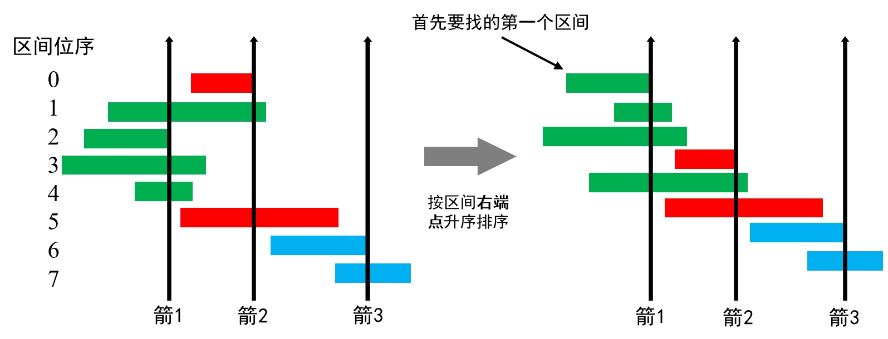

---
tags:
    - Array
    - Greedy
    - Sorting
    - Top Interviews
---

# [452. Minimum Number of Arrows to Burst Balloons](https://leetcode.com/problems/minimum-number-of-arrows-to-burst-balloons/)

There are some spherical balloons taped onto a flat wall that represents the XY-plane. The balloons are represented as a 2D integer array `points` where `points[i] = [xstart, xend]` denotes a balloon whose **horizontal diameter** stretches between `xstart` and `xend`. You do not know the exact y-coordinates of the balloons.

Arrows can be shot up **directly vertically** (in the positive y-direction) from different points along the x-axis. A balloon with `xstart` and `xend` is **burst** by an arrow shot at `x` if `xstart <= x <= xend`. There is **no limit** to the number of arrows that can be shot. A shot arrow keeps traveling up infinitely, bursting any balloons in its path.

Given the array `points`, return *the **minimum** number of arrows that must be shot to burst all balloons*.

 

**Example 1:**

```
Input: points = [[10,16],[2,8],[1,6],[7,12]]
Output: 2
Explanation: The balloons can be burst by 2 arrows:
- Shoot an arrow at x = 6, bursting the balloons [2,8] and [1,6].
- Shoot an arrow at x = 11, bursting the balloons [10,16] and [7,12].
```

**Example 2:**

```
Input: points = [[1,2],[3,4],[5,6],[7,8]]
Output: 4
Explanation: One arrow needs to be shot for each balloon for a total of 4 arrows.
```

**Example 3:**

```
Input: points = [[1,2],[2,3],[3,4],[4,5]]
Output: 2
Explanation: The balloons can be burst by 2 arrows:
- Shoot an arrow at x = 2, bursting the balloons [1,2] and [2,3].
- Shoot an arrow at x = 4, bursting the balloons [3,4] and [4,5].
```

 

**Constraints:**

- `1 <= points.length <= 105`
- `points[i].length == 2`
- `-231 <= xstart < xend <= 231 - 1`


**Solution:**



**题意**

输入一些区间，把这些区间画在数轴上。在数轴上**最少**要放置多少个点，使得每个区间都包含至少一个点？

**思路**
从左到右思考，想一想，第一个点（最左边的点）放在哪最好？

例如 points=[[1,6],[6,7],[2,8],[7,10]]。第一个点放在 x=1 处，只能满足一个区间 [1,6]，而如果放在 x=2 处，则可以满足区间 [1,6],[2,8]。进一步地，如果放在更靠右的 x=6 处，则可以满足三个区间 [1,6],[6,7],[2,8]。注意不能放在 x=7 处，这样没法满足区间 [1,6] 了。

在 x=6 放点后，问题变成剩下 n−3 个区间，在数轴上最少要放置多少个点，使得每个区间都包含至少一个点。这是一个规模更小的子问题，可以用同样的方法解决。

把区间按照右端点从小到大排序，这样第一个点就放在第一个区间的右端点处。去掉包含第一个点的区间后，第二个点就放在剩余区间的第一个区间的右端点处。依此类推。

总结：想清楚第一个点怎么放，是破解这道题的关键。

**算法**

1. 把区间按照右端点从小到大排序。
2. 初始化答案 ans=0，上一个放点的位置 pre=−∞。
3. 遍历区间，如果 start≤pre，那么这个区间已经包含点，跳过。
4. 如果 start>pre，那么必须放一个点，把 ans 加一。根据上面的讨论，当前区间的右端点就是放点的位置，更新 pre=end。
5. 遍历结束后，返回 ans。

**细节**

对于 C++ 等语言，需要注意 start 可能等于 32 位 int 的最小值。代码实现时，可以把 pre 初始化为 64 位 int 的最小值，或者把 pre 初始化成第一个区间的右端点，然后从第二个区间开始遍历。

```java
class Solution {
    public int findMinArrowShots(int[][] points) {
        // Arrays.sort(points, (a,b) -> a[1] - b[1]);
      // Comparator.comparingInt(p -> p[1])可以减少(a, b) -> a[1] - b[1]因为整数溢出造成的错误排序的情况
        Arrays.sort(points, Comparator.comparingInt(p -> p[1]));
        int result = 0;

        long pre = Long.MIN_VALUE;
        
        for (int[] p : points){
            if (p[0] > pre){
                result++;
                pre = p[1];
            }
        }

        return result;
    }
}

// TC: O(nlogn)
// SC: O(1)
  
```

