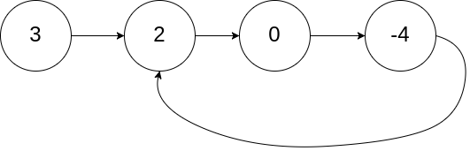
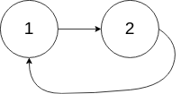
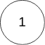
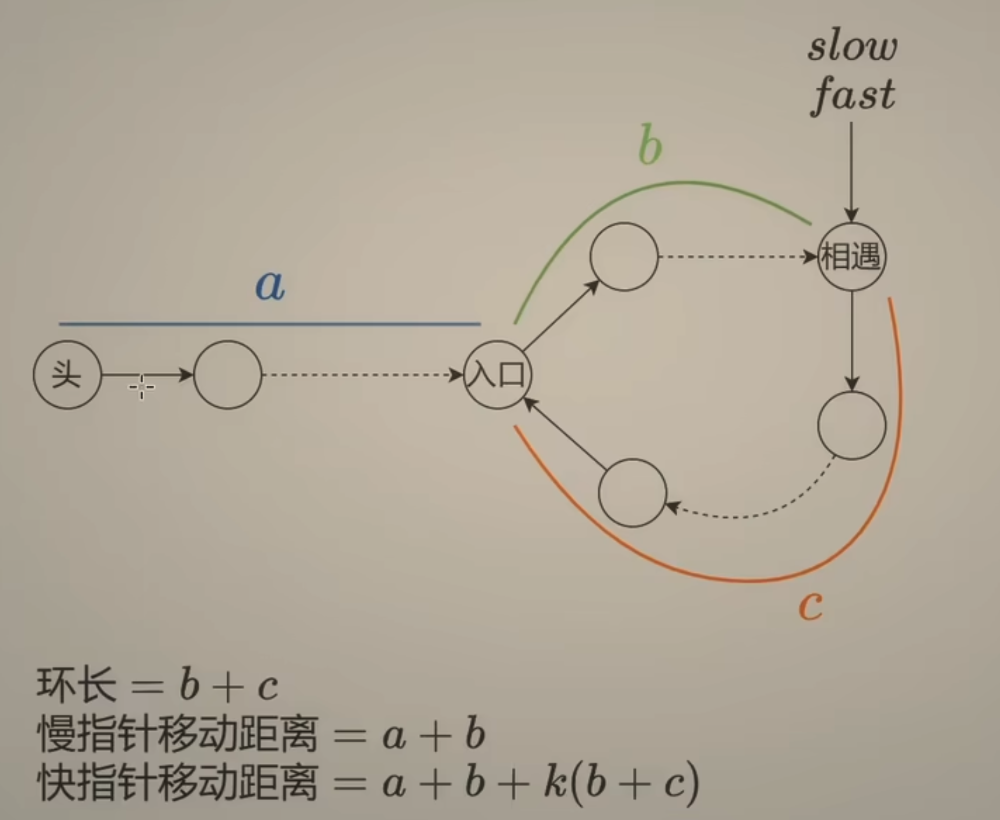
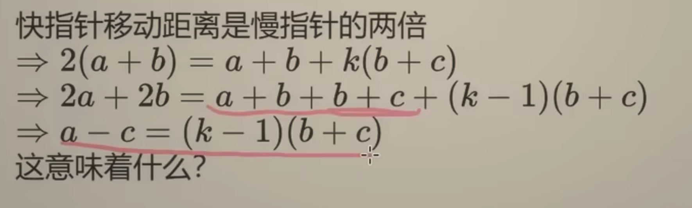
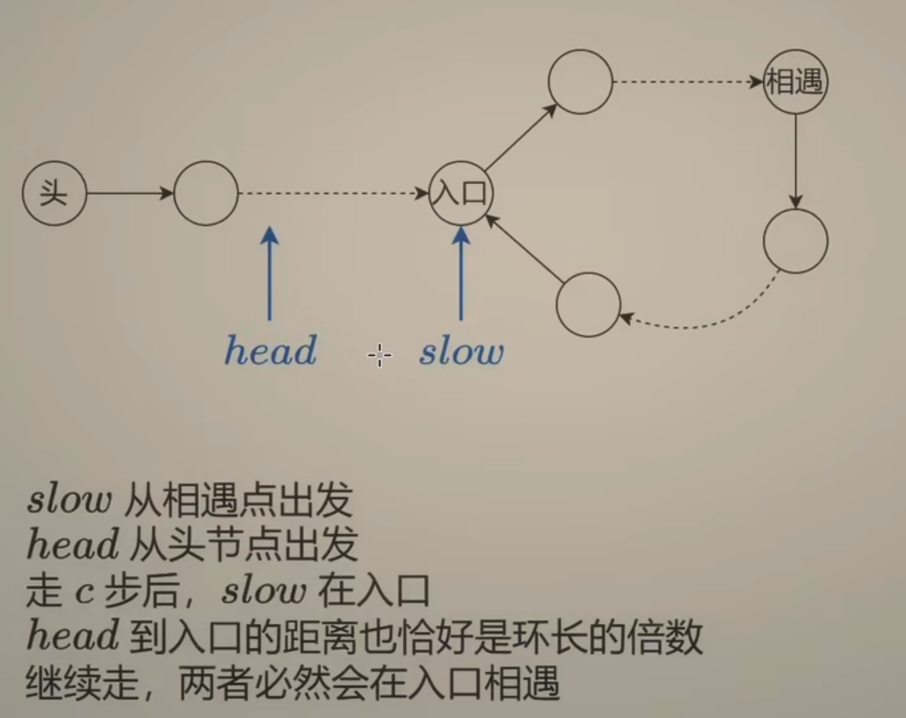
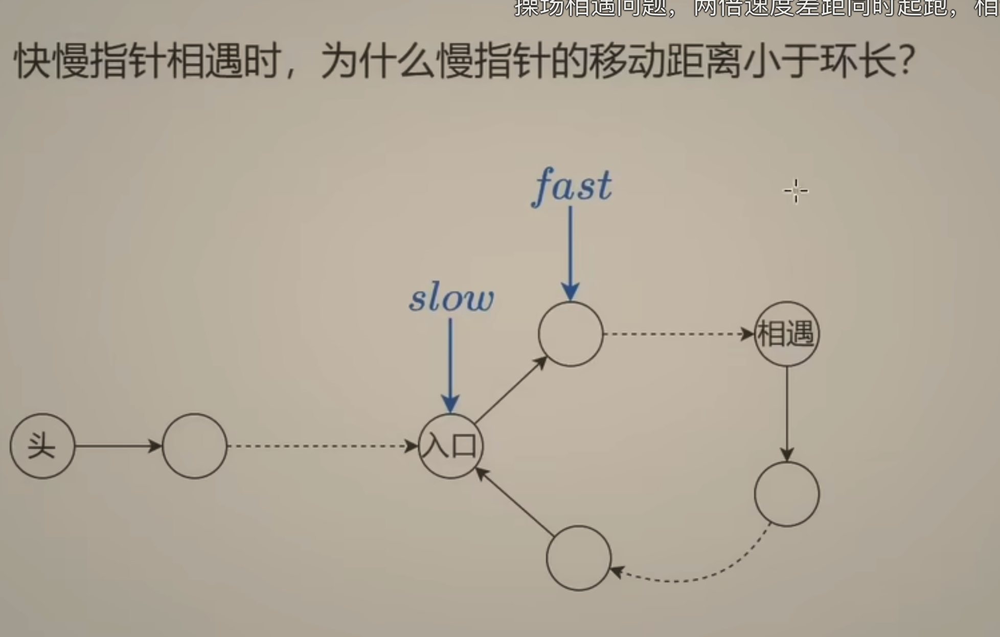
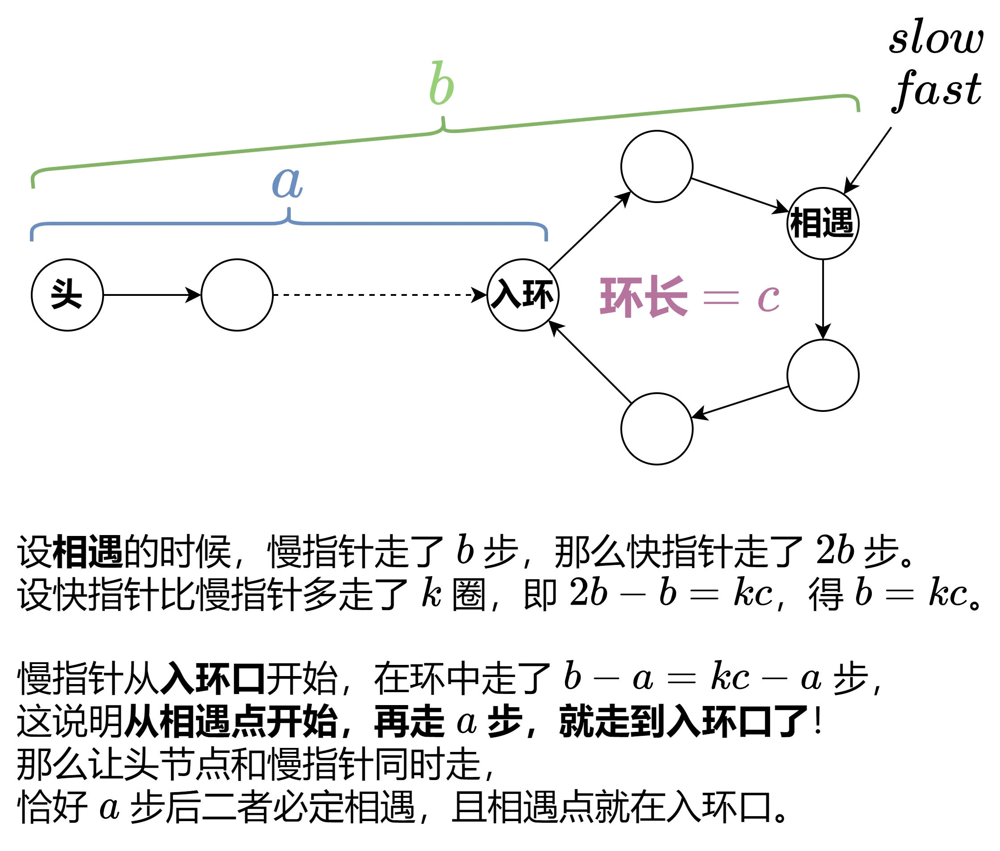

---
tags:
    - Hash Table
    - Linked List
    - Two Pointers
    - Top Interviews
---

# [142. Linked List Cycle II](https://leetcode.com/problems/linked-list-cycle-ii/)

Given the `head` of a linked list, return *the node where the cycle begins. If there is no cycle, return* `null`.

There is a cycle in a linked list if there is some node in the list that can be reached again by continuously following the `next` pointer. Internally, `pos` is used to denote the index of the node that tail's `next` pointer is connected to (**0-indexed**). It is `-1` if there is no cycle. **Note that** `pos` **is not passed as a parameter**.

**Do not modify** the linked list.

 

**Example 1:**



```
Input: head = [3,2,0,-4], pos = 1
Output: tail connects to node index 1
Explanation: There is a cycle in the linked list, where tail connects to the second node.
```

**Example 2:**



```
Input: head = [1,2], pos = 0
Output: tail connects to node index 0
Explanation: There is a cycle in the linked list, where tail connects to the first node.
```

**Example 3:**



```
Input: head = [1], pos = -1
Output: no cycle
Explanation: There is no cycle in the linked list.
```

 

**Constraints:**

- The number of the nodes in the list is in the range `[0, 104]`.
- `-105 <= Node.val <= 105`
- `pos` is `-1` or a **valid index** in the linked-list.

 

**Follow up:** Can you solve it using `O(1)` (i.e. constant) memory?

**Solution:**

**Floyd's Tortoise and Hare Algorithm**

```java
/**
 * Definition for singly-linked list.
 * class ListNode {
 *     int val;
 *     ListNode next;
 *     ListNode(int x) {
 *         val = x;
 *         next = null;
 *     }
 * }
 */
public class Solution {
    public ListNode detectCycle(ListNode head) {
        /*
        
        */
        ListNode slow = head; // b + c
        ListNode fast = head; // 

        

        while(fast != null && fast.next != null){
            slow = slow.next;
            fast = fast.next.next;

            if (slow == fast){
                while(slow != head){
                    slow = slow.next;
                    head = head.next;
                }

                return slow;
            }
        }

        return null;
    }
}
// TC: O(n)
// SC: O(1)
```












```java
/**
 * Definition for singly-linked list.
 * class ListNode {
 *     int val;
 *     ListNode next;
 *     ListNode(int x) {
 *         val = x;
 *         next = null;
 *     }
 * }
 */
public class Solution {
    public ListNode detectCycle(ListNode head) {
       Set<ListNode> set = new HashSet<>(); 
       ListNode cur = head;
       while(cur != null){
        if (!set.contains(cur)){
            set.add(cur);
            cur = cur.next;
        }else{
            return cur;
        }
       }
       return cur;
    }
}

// TC: O(n)
// SC: O(n)
```

