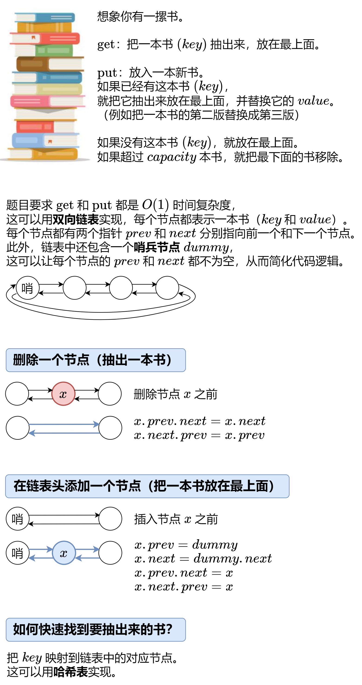

---
tags:
    - Hash Table
    - Linked List
    - Design
    - Doubly-Linked List
    - Top Interviews
---

# [146. LRU Cache](https://leetcode.com/problems/lru-cache/)

Design a data structure that follows the constraints of a **[Least Recently Used (LRU) cache](https://en.wikipedia.org/wiki/Cache_replacement_policies#LRU)**.

Implement the `LRUCache` class:

- `LRUCache(int capacity)` Initialize the LRU cache with **positive** size `capacity`.
- `int get(int key)` Return the value of the `key` if the key exists, otherwise return `-1`.
- `void put(int key, int value)` Update the value of the `key` if the `key` exists. Otherwise, add the `key-value` pair to the cache. If the number of keys exceeds the `capacity` from this operation, **evict** the least recently used key.

The functions `get` and `put` must each run in `O(1)` average time complexity.


**Example 1:**

```
Input
["LRUCache", "put", "put", "get", "put", "get", "put", "get", "get", "get"]
[[2], [1, 1], [2, 2], [1], [3, 3], [2], [4, 4], [1], [3], [4]]
Output
[null, null, null, 1, null, -1, null, -1, 3, 4]

Explanation
LRUCache lRUCache = new LRUCache(2);
lRUCache.put(1, 1); // cache is {1=1}
lRUCache.put(2, 2); // cache is {1=1, 2=2}
lRUCache.get(1);    // return 1
lRUCache.put(3, 3); // LRU key was 2, evicts key 2, cache is {1=1, 3=3}
lRUCache.get(2);    // returns -1 (not found)
lRUCache.put(4, 4); // LRU key was 1, evicts key 1, cache is {4=4, 3=3}
lRUCache.get(1);    // return -1 (not found)
lRUCache.get(3);    // return 3
lRUCache.get(4);    // return 4
```


**Solution:**

个人偏向Doubly-Linked List more easy to understand

```java
class LRUCache {
    //     inital: head, tail, global capacity, size, map

    class ListNode{
        int key;
        int value;
        ListNode prev;
        ListNode next;
        ListNode(int key, int value){
            this.key = key;
            this.value = value;
        }
    }

    ListNode head;
    ListNode tail;
    int capacity;
    int curSize;
    Map<Integer, ListNode> cacheMap;

    public LRUCache(int capacity) {
        this.capacity = capacity;
        int curSize = 0;
        head = new ListNode(0, 0);
        tail = new ListNode(0, 0);
        head.next = tail;
        tail.prev = head;
        cacheMap = new HashMap<>();
    }

    /*
        get():
    1. check whether contains from map
        1.1 yes   
            update recently
                1.1.1 remove curpositon
                1.1.2 movetohead
            return node
        1.2 no return -1;

    */
    
    public int get(int key) {
        ListNode node = cacheMap.get(key);
        if (node != null){
            updateRecent(node);
            return node.value;
        }else {
            return -1;
        }
        
    }

    public void updateRecent(ListNode node){
        remove(node);
        moveToHead(node);
    }

    public void remove(ListNode node){
        node.prev.next = node.next;
        node.next.prev = node.prev;
    }

    public void moveToHead(ListNode node){
        node.prev = head;
        node.next = head.next;

        head.next.prev = node;
        head.next = node;
    }
    /*
        put():
    1. check whether contains from map
        1.1 yes 
            update value
            update recently
        1.2 no
            check capacity
            1.2.1 size >= capacity
                remove lastone
                    1.2.1 remove from map
                    1.2.1 remove from linked
                put new node
            1.2.2 size < capacity
                put head;
                update size

    */
    public void put(int key, int value) {
        ListNode node = cacheMap.get(key);
        if (node != null){
            updateRecent(node);
            node.value = value;
            return;
        }


        if (node == null){
            ListNode newNode = new ListNode(key, value);
            if (curSize == capacity){
                ListNode lastOne = tail.prev;
                cacheMap.remove(lastOne.key);
                remove(lastOne);
                curSize--;

                moveToHead(newNode);
                cacheMap.put(key, newNode);
                curSize++;
            }else{
                // curSize < capacity; 
                moveToHead(newNode);
                cacheMap.put(key, newNode);
                curSize++;

            }

            return;
        }

    }
}

/**
 * Your LRUCache object will be instantiated and called as such:
 * LRUCache obj = new LRUCache(capacity);
 * int param_1 = obj.get(key);
 * obj.put(key,value);
 */


 // high level idea
 /*
    key components: 
    recently used   -> in order -> old used
                <--------------->
              head              tail
    capacity (global variable) -> old used 

    -> get -> O(1) -> Map 
    
    high: 1. use double linkedList to maintain recently used   and oldest used
    2. glbal capacity (put)
    3. get(1) -> Map
    datastructure: Map, double linkedList 


    implement: 
    inital: head, tail, global capacity, size, map

    get():
    1. check whether contains from map
        1.1 yes   
            update recently
            return node
        1.2 no return -1;


    put():
    1. check whether contains from map
        1.1 yes 
            update value
            update recently
        1.2 no
            check capacity
            1.2.1 size >= capacity
                remove lastone
                put new node
            1.2.2 size < capacity
                put head;
                update size

 */
```





```java
class LRUCache {
    //     inital: head, tail, global capacity, size, map

    class ListNode{
        int key;
        int value;
        ListNode prev;
        ListNode next;
        ListNode(int key, int value){
            this.key = key;
            this.value = value;
        }
    }

    ListNode head;
    ListNode tail;
    int capacity;
    int curSize;
    Map<Integer, ListNode> cacheMap;

    public LRUCache(int capacity) {
        this.capacity = capacity;
        int curSize = 0;
        head = new ListNode(0, 0);
        tail = new ListNode(0, 0);
        head.next = tail;
        tail.prev = head;
        cacheMap = new HashMap<>();
    }

    /*
        get():
    1. check whether contains from map
        1.1 yes   
            update recently
                1.1.1 remove curpositon
                1.1.2 movetohead
            return node
        1.2 no return -1;

    */
    
    public int get(int key) {
        ListNode node = cacheMap.get(key);
        if (node != null){
            updateRecent(node);
            return node.value;
        }else {
            return -1;
        }
        
    }

    public void updateRecent(ListNode node){
        remove(node);
        moveToHead(node);
    }

    public void remove(ListNode node){
        node.prev.next = node.next;
        node.next.prev = node.prev;
    }

    public void moveToHead(ListNode node){
        node.prev = head;
        node.next = head.next;

        head.next.prev = node;
        head.next = node;
    }
    /*
        put():
    1. check whether contains from map
        1.1 yes 
            update value
            update recently
        1.2 no
            check capacity
            1.2.1 size >= capacity
                remove lastone
                    1.2.1 remove from map
                    1.2.1 remove from linked
                put new node
            1.2.2 size < capacity
                put head;
                update size

    */
    public void put(int key, int value) {
        ListNode node = cacheMap.get(key);
        if (node != null){
            updateRecent(node);
            node.value = value;
            return;
        }


        if (node == null){
            ListNode newNode = new ListNode(key, value);
            if (curSize == capacity){
                ListNode lastOne = tail.prev;
                cacheMap.remove(lastOne.key);
                remove(lastOne);
                curSize--;

                moveToHead(newNode);
                cacheMap.put(key, newNode);
                curSize++;
            }else{
                // curSize < capacity; 
                moveToHead(newNode);
                cacheMap.put(key, newNode);
                curSize++;

            }

            return;
        }

    }
}

/**
 * Your LRUCache object will be instantiated and called as such:
 * LRUCache obj = new LRUCache(capacity);
 * int param_1 = obj.get(key);
 * obj.put(key,value);
 */


 // high level idea
 /*
    key components: 
    recently used   -> in order -> old used
                <--------------->
              head              tail
    capacity (global variable) -> old used 

    -> get -> O(1) -> Map 
    
    high: 1. use double linkedList to maintain recently used   and oldest used
    2. glbal capacity (put)
    3. get(1) -> Map
    datastructure: Map, double linkedList 


    implement: 
    inital: head, tail, global capacity, size, map

    get():
    1. check whether contains from map
        1.1 yes   
            update recently
            return node
        1.2 no return -1;


    put():
    1. check whether contains from map
        1.1 yes 
            update value
            update recently
        1.2 no
            check capacity
            1.2.1 size >= capacity
                remove lastone
                put new node
            1.2.2 size < capacity
                put head;
                update size

 */
```


```java
class LRUCache {
    class Node{
        int key;
        int value;
        Node next;
        Node prev;
        Node(int key, int value){
            this.key = key;
            this.value = value;
        }
    }

    Map<Integer, Node> cache = new HashMap<>();
    int capacity;
    int size;
    Node head;
    Node tail; 
    public LRUCache(int capacity) {
        this.size = 0;
        this.capacity = capacity;
        head = new Node(-1, -1);
        tail = new Node(-1, -1);
        head.next = tail;
        tail.prev = head;
    }
    
    public int get(int key) {
        Node node = cache.get(key);
        if (node == null){
            return -1;
        }

        updateRecent(node);
        return node.value;
    }

    public void updateRecent(Node node){
        removeNode(node);
        addToHead(node);
    }

    public void removeNode(Node node){
        node.next.prev = node.prev;
        node.prev.next = node.next;

    }

    public void addToHead(Node node){
        Node rem = head.next;
        rem.prev = node;
        head.next = node;
        node.prev = head;
        node.next = rem;
    }

    
    public void put(int key, int value) {
        if (!cache.containsKey(key)){
            Node node = new Node(key, value);
            if (size == capacity){
                Node last = tail.prev;
                cache.remove(last.key);
                removeNode(last);
                size--;

                cache.put(key, node);
                addToHead(node);
                size++;
            }else{
                cache.put(key, node);
                addToHead(node);
                size++;
            }
        }else{
            Node node = cache.get(key);
            updateRecent(node);
            node.value = value;
        }
    }

}

/**
 * Your LRUCache object will be instantiated and called as such:
 * LRUCache obj = new LRUCache(capacity);
 * int param_1 = obj.get(key);
 * obj.put(key,value);
 */
```


**Doubly Linked List**

```java
class LRUCache {
    static class Node {
        int key;
        int value;
        Node prev;
        Node next;

        Node(int key, int value){
            this.key = key;
            this.value = value;
        }
    }

    private Map<Integer, Node> cache = new HashMap<Integer, Node>();
    private int capacity;
    private int size;
    private Node head;
    private Node tail;

    public LRUCache(int capacity) {
        this.size = 0;
        this.capacity = capacity;
        head = new Node(-1, -1);
        tail = new Node(-1, -1);
        head.next = tail;
        tail.prev = head;
    }
    
    public int get(int key) {
        Node node = cache.get(key);
        if (node == null){
            return -1;
        }else{
            updateRecent(node);
            return node.value;
        }
    }

    private void updateRecent(Node node){
        removeNode(node);
        addToHead(node);
    }

    private void removeNode(Node node){
        node.next.prev = node.prev;
        node.prev.next = node.next;
    }

    private void addToHead(Node node){
        node.prev = head;
        node.next = head.next;
        head.next.prev = node;
        head.next = node;
    }
    
    public void put(int key, int value) {
        Node node = cache.get(key);

        if (node == null){
            Node newNode = new Node(key, value);
            cache.put(key, newNode);
            addToHead(newNode);
            size = size + 1;

            if (size > capacity){
                Node lastOne = removeLast();
                cache.remove(lastOne.key);
                size = size -1;
            }
        }else{
            // node != null
            updateRecent(node);
            node.value = value;
        }
    }
    
    private Node removeLast(){
        Node lastOne = tail.prev;
        removeNode(lastOne);
        return lastOne; 
    }
}

/**
 * Your LRUCache object will be instantiated and called as such:
 * LRUCache obj = new LRUCache(capacity);
 * int param_1 = obj.get(key);
 * obj.put(key,value);
 */

 // TC: O(1)
 // SC: O(n)

 
```


```java
class LRUCache {
  	static class Node{
        int key; 
        int value;
        Node next;
        Node prev;
        Node(int key, int value){
            this.key = key;
            this.value = value;
        }
    }

    private Map<Integer, Node> cache = new HashMap<Integer, Node>();
    private int size;
    private int capacity;
    private Node head;
    private Node tail;
    // 伪头部和伪尾部节点，用于方便地添加和删除节点

    public LRUCache(int capacity) {
        this.size = 0;
        this.capacity = capacity;

        // 初始化伪头部和伪尾部节点
        head = new Node(-1, -1);
        tail = new Node(-1, -1);
        head.next = tail;
        tail.prev = head;
        
    }
    
    public int get(int key) {
        Node node = cache.get(key);
        if (node == null){
            return -1;
        }

        // 将访问的节点移动到双向链表的头部
        moveToHead(node);
        return node.value;
        
    }
    
    public void put(int key, int value) {
        Node node = cache.get(key);
        if (node == null){
            // 如果键不存在，创建新的节点
            Node newNode = new Node(key, value);
            // 添加进哈希表
            cache.put(key, newNode);
             // 添加至双向链表的头部
            addToHead(newNode);
            size = size + 1;
            if (size > capacity){
                // 如果超过容量，删除双向链表的尾部节点
                Node tail = removeTail();
                cache.remove(tail.key);
                size = size - 1;
            }
        }else{
            node.value = value;
            moveToHead(node);
        }
    }

    private void addToHead(Node node){
        node.prev = head;
        node.next = head.next;
        head.next.prev = node;
        head.next = node;
    }

    private void removeNode(Node node){
        node.prev.next = node.next;
        node.next.prev = node.prev;
    }

    private void moveToHead(Node node){
        removeNode(node);
        addToHead(node);
    }

    private Node removeTail(){
        Node res = tail.prev;
        removeNode(res);
        return res;
    }
}

/**
 * Your LRUCache object will be instantiated and called as such:
 * LRUCache obj = new LRUCache(capacity);
 * int param_1 = obj.get(key);
 * obj.put(key,value);
 */

// TC: O(1)
// SC: O(n)
```


标准库

```java
class LRUCache {
    private final int capacity;
    private final Map<Integer, Integer> cache = new LinkedHashMap<>();
    // 内置 LRU
    public LRUCache(int capacity) {
        this.capacity = capacity;
    }
    
    public int get(int key) {
        // 删除key,并利用返回值判断key是否在cache中
        Integer value = cache.remove(key);
        if (value != null){
            cache.put(key, value);
            return value;
        }

        return -1; // key 不在cache中
    }
    
    public void put(int key, int value) {
        // 删除key, 并利用返回值判断key是否在cache中
        if (cache.remove(key) != null){
            cache.put(key, value);
            return;
        }

        // key不在cache中, 那么就把key插入cache, 插入前判断cache是否满了
        if (cache.size() == capacity){  // cache满了
            Integer eldestKey = cache.keySet().iterator().next();
            cache.remove(eldestKey); // 移除最久未使用 key
        }
        cache.put(key, value);
    }
}

/**
 * Your LRUCache object will be instantiated and called as such:
 * LRUCache obj = new LRUCache(capacity);
 * int param_1 = obj.get(key);
 * obj.put(key,value);
 */
// TC: O(1)
// SC: O(min(p, capacity)), 其中 p 为 put 的调用次数。
```


**Built-in**

```java
class LRUCache {
    int capacity;
    LinkedHashMap<Integer, Integer> dic;

    public LRUCache(int capacity) {
        this.capacity = capacity;
        dic = new LinkedHashMap<>(5, 0.75f, true) {
            @Override
            protected boolean removeEldestEntry(
                Map.Entry<Integer, Integer> eldest
            ) {
                return size() > capacity;
            }
        };
    }

    public int get(int key) {
        return dic.getOrDefault(key, -1);
    }

    public void put(int key, int value) {
        dic.put(key, value);
    }
}
/**
 * Your LRUCache object will be instantiated and called as such:
 * LRUCache obj = new LRUCache(capacity);
 * int param_1 = obj.get(key);
 * obj.put(key,value);
 */
```


```java
class LRUCache extends LinkedHashMap<Integer, Integer>{
    private static final float DEFAULT_LOAD_FACTOR = 0.75f;
    private final int capacity;
    public LRUCache(int capacity) {
        super(capacity, DEFAULT_LOAD_FACTOR, true);
        this.capacity = capacity;
    }
    
    public int get(int key) {
        return super.getOrDefault(key, -1);
    }


    @Override
    protected boolean removeEldestEntry(Map.Entry<Integer, Integer> eldest) {
        return size() > capacity;
    }
}

/**
 * Your LRUCache object will be instantiated and called as such:
 * LRUCache obj = new LRUCache(capacity);
 * int param_1 = obj.get(key);
 * obj.put(key,value);
 */
```


