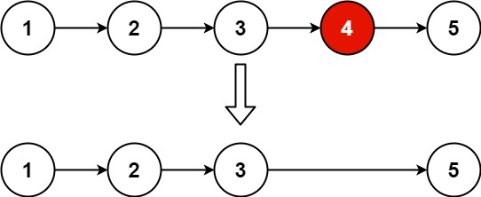
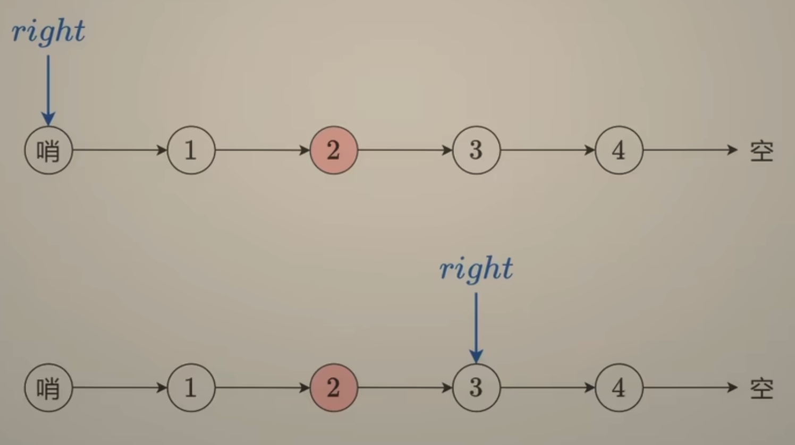
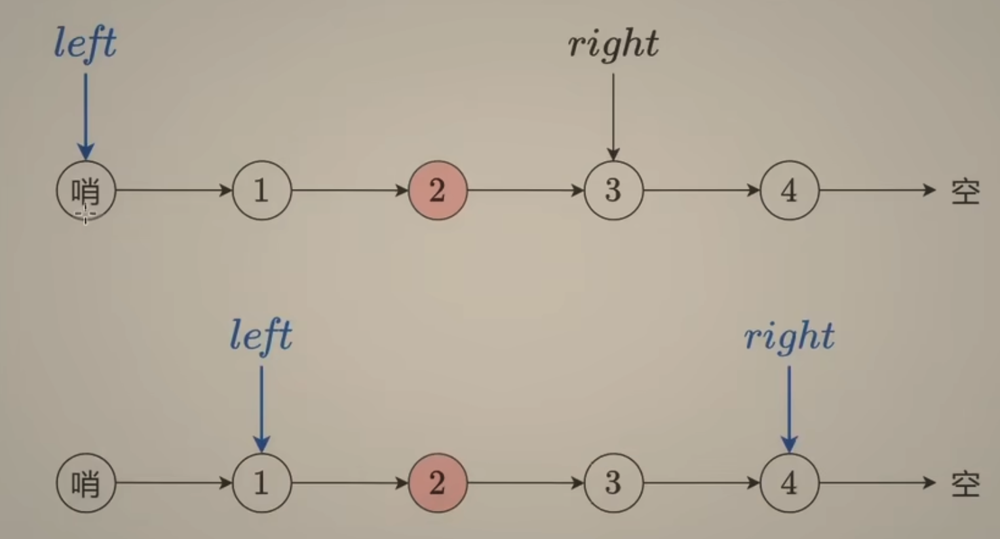
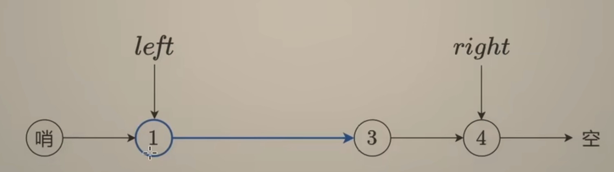

---
tags:
    - Linked List
    - Two Pointers
    - Top Interviews
---

# [19. Remove Nth Node From End of List](https://leetcode.com/problems/remove-nth-node-from-end-of-list/) ✅

Given the `head` of a linked list, remove the `nth` node from the end of the list and return its head. 

**Example 1:**



```
Input: head = [1,2,3,4,5], n = 2
Output: [1,2,3,5]
```

**Example 2:**

```
Input: head = [1], n = 1
Output: []
```

**Example 3:**

```
Input: head = [1,2], n = 1
Output: [1]
```

 

**Constraints:**

- The number of nodes in the list is `sz`.
- `1 <= sz <= 30`
- `0 <= Node.val <= 100`
- `1 <= n <= sz`

 

**Follow up:** Could you do this in one pass?


**Solution:**

```java
/**
 * Definition for singly-linked list.
 * public class ListNode {
 *     int val;
 *     ListNode next;
 *     ListNode() {}
 *     ListNode(int val) { this.val = val; }
 *     ListNode(int val, ListNode next) { this.val = val; this.next = next; }
 * }
 */
class Solution {
    public ListNode removeNthFromEnd(ListNode head, int n) {
        ListNode cur = head;

        int count = 0;
        
        while(cur != null){
            cur = cur.next;
            count++;
        }
        /*
        0 1 2 3 4
        1 2 3 4 5
            p
              c
        4 - 2 + 1 = 3
        */
        if (count == 1){
            return null;
        }

        

        int remove = count - n; // 2 -2 

        if (remove == 0){
            return head.next;
        }
        cur = head;
        ListNode prev = head;

        for (int i = 0; i < remove; i++){
            prev = cur;
            cur = cur.next;
        }

        prev.next = cur.next;
        return head;
    }
}

// TC: O(n)
// SC: O(1)
```

逻辑没有那么难， special case需要注意


```java
/**
 * Definition for singly-linked list.
 * public class ListNode {
 *     int val;
 *     ListNode next;
 *     ListNode() {}
 *     ListNode(int val) { this.val = val; }
 *     ListNode(int val, ListNode next) { this.val = val; this.next = next; }
 * }
 */
class Solution {
    public ListNode removeNthFromEnd(ListNode head, int n) {
        // base case
        if (head.next == null){
            return null;
        }
 

        ListNode dummy = head;

        int count = 0;
        while(dummy != null){
            dummy = dummy.next;
            count++;
        }

        int m = count - n; // 5-2 = 3

        if (m == 0){
            return head.next;
        }
        ListNode cur = head;
        ListNode next = null;
        ListNode prev = null;
        for (int i = 0; i < m; i++){
            prev = cur;
            cur = cur.next; 
        }

        prev.next = cur.next;

        return head;


    }
}
// TC: O(n)
// SC: O(1)
```


Linked List 和 Tree 似乎都围绕着遍历


对于删除节点来说什么时候需要用到哨兵节点? 什么时候不需要?







```java
/**
 * Definition for singly-linked list.
 * public class ListNode {
 *     int val;
 *     ListNode next;
 *     ListNode() {}
 *     ListNode(int val) { this.val = val; }
 *     ListNode(int val, ListNode next) { this.val = val; this.next = next; }
 * }
 */
class Solution {
    public ListNode removeNthFromEnd(ListNode head, int n) {
        ListNode dummy = new ListNode(-1);
        dummy.next = head;
        ListNode right = dummy;

        for (int i = 0; i < n; i++){
            right = right.next;
        }

        ListNode left = dummy;

        while(right.next != null){
            right = right.next;
            left = left.next;
        }

        left.next = left.next.next;

        return dummy.next;
    }
}

// TC: O(n)
// SC: O(1)
```

