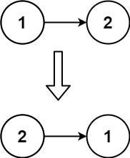

---
tags:
  - Linked List
  - Recursion
---

# [206. Reverse Linked List](https://leetcode.com/problems/reverse-linked-list/) 

Given the `head` of a singly linked list, reverse the list, and return _the reversed list_.

**Example 1:**


```
Input: head = [1,2,3,4,5]
Output: [5,4,3,2,1]
```

**Example 2:**



```
Input: head = [1,2]
Output: [2,1]
```

**Example 3:**

```
Input: head = []
Output: []
```

**Solution:**

iterate:

```java
/**
 * Definition for singly-linked list.
 * public class ListNode {
 *     int val;
 *     ListNode next;
 *     ListNode() {}
 *     ListNode(int val) { this.val = val; }
 *     ListNode(int val, ListNode next) { this.val = val; this.next = next; }
 * }
 */
class Solution {
    public ListNode reverseList(ListNode head) {
        if (head == null || head.next == null){
            return head;
        }

        ListNode cur = head;
        ListNode pre = null;
        while(cur != null){
            ListNode next = cur.next;
            cur.next = pre;
            pre = cur;
            cur = next;

        }
        return pre;

    }
}

// TC: O(n)
// SC: O(1)
```


recursive:

```java
/**
 * Definition for singly-linked list.
 * public class ListNode {
 *     int val;
 *     ListNode next;
 *     ListNode() {}
 *     ListNode(int val) { this.val = val; }
 *     ListNode(int val, ListNode next) { this.val = val; this.next = next; }
 * }
 */
class Solution {
    public ListNode reverseList(ListNode head) {
        if (head == null || head.next == null){
            return head;
        }

        ListNode next = reverseList(head.next);
        head.next.next = head;
        head.next = null;
        return next;
    }
}

// TC: O(n)
// SC: O(n) // stack
```


反转结束后, 从原来的链表上看:

pre指向反转这一段的末尾

cur指向反转这一段后续的下一个节点

