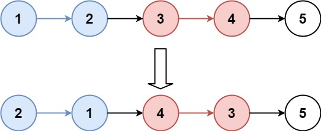
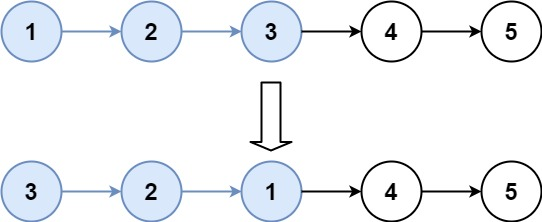

---
tags:
    - Linked List
    - Recursion
    - Top Interviews
---


#[25. Reverse Nodes in k-Group](https://leetcode.com/problems/reverse-nodes-in-k-group/)

Given the `head` of a linked list, reverse the nodes of the list `k` at a time, and return *the modified list*.

`k` is a positive integer and is less than or equal to the length of the linked list. If the number of nodes is not a multiple of `k` then left-out nodes, in the end, should remain as it is.

You may not alter the values in the list's nodes, only nodes themselves may be changed.

 **Example 1:**



```
Input: head = [1,2,3,4,5], k = 2
Output: [2,1,4,3,5]
```

**Example 2:**



```
Input: head = [1,2,3,4,5], k = 3
Output: [3,2,1,4,5]
```

 

**Constraints:**

- The number of nodes in the list is `n`.
- `1 <= k <= n <= 5000`
- `0 <= Node.val <= 1000`

 

**Follow-up:** Can you solve the problem in `O(1)` extra memory space?


Solution:

iterative:

```java
/**
 * Definition for singly-linked list.
 * public class ListNode {
 *     int val;
 *     ListNode next;
 *     ListNode() {}
 *     ListNode(int val) { this.val = val; }
 *     ListNode(int val, ListNode next) { this.val = val; this.next = next; }
 * }
 */
class Solution {
    public ListNode reverseKGroup(ListNode head, int k) {
        int n = 0;
        ListNode cur = head;
        while(cur != null){
            cur = cur.next;
            n++;
        } 

        ListNode dummy = new ListNode(-1);
        dummy.next = head;
        ListNode p0 = dummy;

        ListNode pre = null;
        cur = head;

        while(n >= k){
            n = n - k;
            for (int i = 0; i < k; i++){
                ListNode next = cur.next;
                cur.next = pre;
                pre = cur;
                cur = next;
            }
            ListNode next = p0.next;
            p0.next.next = cur;
            p0.next = pre;
            p0 = next;

            
        }


        return dummy.next;
    }
}
// TC: O(n)
// SC: O(1)
```


recursive:

```java
/**
 * Definition for singly-linked list.
 * public class ListNode {
 *     int val;
 *     ListNode next;
 *     ListNode() {}
 *     ListNode(int val) { this.val = val; }
 *     ListNode(int val, ListNode next) { this.val = val; this.next = next; }
 * }
 */
class Solution {
    public ListNode reverseKGroup(ListNode head, int k) {
        if (head == null){
            return head;
        }

        ListNode curr = head;
        ListNode dummy = null;
        ListNode prev = null;
        int count = 0;

        while(curr != null && count < k){
            curr = curr.next;
            count++;
        } 

        curr = head;

        if (count == k){
            count = 0;
            while(curr != null && count < k){
                dummy = curr.next;
                curr.next = prev;
                prev = curr;
                curr = dummy;
                count++;
            }
        }else{
            prev = head;
        }

        if (dummy != null){
            head.next = reverseKGroup(dummy, k);
        }

        return prev;
    }
}

// TC: O(n)
// SC: O(n)
```

