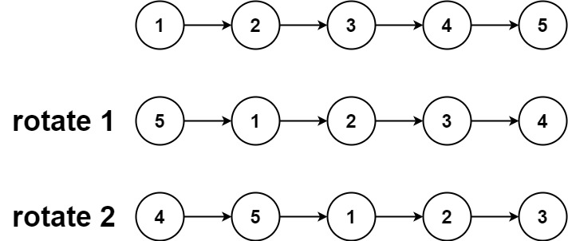
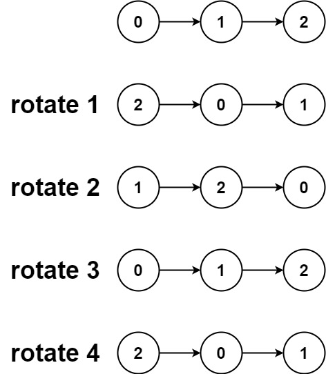

---
tags:
    - Linked List
    - Two Pointers
    - Top Interviews
---

# [61. Rotate List](https://leetcode.com/problems/rotate-list/)

Given the `head` of a linked list, rotate the list to the right by `k` places.

 

**Example 1:**



```
Input: head = [1,2,3,4,5], k = 2
Output: [4,5,1,2,3]
```

**Example 2:**



```
Input: head = [0,1,2], k = 4
Output: [2,0,1]
```

 

**Constraints:**

- The number of nodes in the list is in the range `[0, 500]`.
- `-100 <= Node.val <= 100`
- `0 <= k <= 2 * 109`


Solution:

```java
/**
 * Definition for singly-linked list.
 * public class ListNode {
 *     int val;
 *     ListNode next;
 *     ListNode() {}
 *     ListNode(int val) { this.val = val; }
 *     ListNode(int val, ListNode next) { this.val = val; this.next = next; }
 * }
 */
class Solution {
    public ListNode rotateRight(ListNode head, int k) {
        if (head == null || head.next == null || k == 0){
            return head;
        }

        // 1. compute length and get tail
        int len = 1;
        ListNode tail = head;
        while(tail.next != null){
            len++;
            tail = tail.next;
        }

        // 2. make it a ring
        tail.next = head;

        // 3. normalize k 
        k = k % len;

        if (k == 0){
            tail.next = null;
            return head;
        }

        // 4. find new tail: len - k - 1 steps from original head;
        int stepsToNewTail = len - k - 1;
        ListNode newTail = head;
        for (int i = 0; i < stepsToNewTail; i++){
            newTail = newTail.next;
        }

        // 5. new head and break the ring
        ListNode newHead = newTail.next;
        newTail.next = null;


        return newHead;

    }
}
// TC: O(n)
// SC: O(1)
```


```java
/**
 * Definition for singly-linked list.
 * public class ListNode {
 *     int val;
 *     ListNode next;
 *     ListNode() {}
 *     ListNode(int val) { this.val = val; }
 *     ListNode(int val, ListNode next) { this.val = val; this.next = next; }
 * }
 */
class Solution {
    public ListNode rotateRight(ListNode head, int k) {
        if (head == null || head.next == null || k == 0){
            return head;
        }

        ListNode cur = head;
        int len = 1;
        while(cur.next != null){
            len++;
            cur = cur.next;
        }

        k = k % len; // 5 % 2 = 2 
        if (k == 0){
            return head;
        }

        int tailCut = len - k - 1; // 5-2 =3    3 - 1 =2 
        cur.next = head;
        ListNode tail = head;
        for (int i = 0; i < tailCut; i++){
            tail = tail.next;
        }

        
        ListNode newHead = tail.next;
        tail.next = null;
        return newHead;
        
    }
}
```


```java
/**
 * Definition for singly-linked list.
 * public class ListNode {
 *     int val;
 *     ListNode next;
 *     ListNode() {}
 *     ListNode(int val) { this.val = val; }
 *     ListNode(int val, ListNode next) { this.val = val; this.next = next; }
 * }
 */
class Solution {
    public ListNode rotateRight(ListNode head, int k) {
        if (head == null){
            return head;
        }

        int len = 0;
        ListNode cur = head;
        while(cur != null){
            len = len + 1;
            cur = cur.next;
        }
        for (int i = 0; i < k % len ; i++){
            rotate(head);
        }

        return head;
    }

    private void rotate(ListNode head){
        int first = head.val;
        int nxt = 0;
        int pre = 0;
        ListNode cur = head;
        while(cur != null){
            pre = nxt;
            nxt = cur.val;
            cur.val = pre;
            cur = cur.next;
        }

        head.val = nxt;

        return;
    }
}

// TC: O(n)
// SC: O(1)
```


