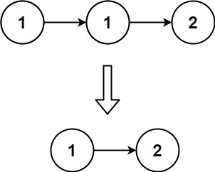
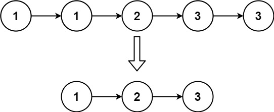

---
tags:
    - Linked List
    - Top Interviews
---


# [83. Remove Duplicates from Sorted List](https://leetcode.com/problems/remove-duplicates-from-sorted-list/)

Given the `head` of a sorted linked list, *delete all duplicates such that each element appears only once*. Return *the linked list **sorted** as well*.

 

**Example 1:**



```
Input: head = [1,1,2]
Output: [1,2]
```

**Example 2:**



```
Input: head = [1,1,2,3,3]
Output: [1,2,3]
```

 

**Constraints:**

- The number of nodes in the list is in the range `[0, 300]`.
- `-100 <= Node.val <= 100`
- The list is guaranteed to be **sorted** in ascending order.

```java
/**
 * Definition for singly-linked list.
 * public class ListNode {
 *     int val;
 *     ListNode next;
 *     ListNode() {}
 *     ListNode(int val) { this.val = val; }
 *     ListNode(int val, ListNode next) { this.val = val; this.next = next; }
 * }
 */
class Solution {
    public ListNode deleteDuplicates(ListNode head) {
        if (head == null){
            return null;
        }

        ListNode cur = head;
        while(cur.next != null){
            if (cur.next.val == cur.val){
                cur.next = cur.next.next;
            }else{
                cur = cur.next;
            }
        }

        return head;
        
    }
}

// TC: O(n)
// SC: O(1)
```

