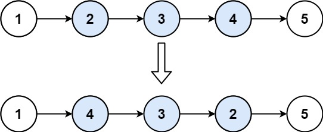

---
tags:
    - Linked List
    - Top Interviews
---


# [92. Reverse Linked List II](https://leetcode.com/problems/reverse-linked-list-ii/)

Given the `head` of a singly linked list and two integers `left` and `right` where `left <= right`, reverse the nodes of the list from position `left` to position `right`, and return *the reversed list*.

 

**Example 1:**



```
Input: head = [1,2,3,4,5], left = 2, right = 4
Output: [1,4,3,2,5]
```

**Example 2:**

```
Input: head = [5], left = 1, right = 1
Output: [5]
```

 

**Constraints:**

- The number of nodes in the list is `n`.
- `1 <= n <= 500`
- `-500 <= Node.val <= 500`
- `1 <= left <= right <= n`

 

**Follow up:** Could you do it in one pass?


Solution:

```java
/**
 * Definition for singly-linked list.
 * public class ListNode {
 *     int val;
 *     ListNode next;
 *     ListNode() {}
 *     ListNode(int val) { this.val = val; }
 *     ListNode(int val, ListNode next) { this.val = val; this.next = next; }
 * }
 */
class Solution {
    public ListNode reverseBetween(ListNode head, int left, int right) {
        ListNode dummy = new ListNode(-1);

        dummy.next = head;

        ListNode p0 = dummy;

        for (int i = 0; i < left - 1; i++){
            p0 = p0.next;
        }

        ListNode pre = null;
        ListNode cur = p0.next;

        for (int i = 0; i < (right - left + 1); i++){
            ListNode next = cur.next;
            cur.next = pre;
            pre = cur;
            cur = next;
        }

        p0.next.next = cur;
        p0.next = pre;

        return dummy.next;

    }
}


// TC: O(n)
// SC: O(1)
```

