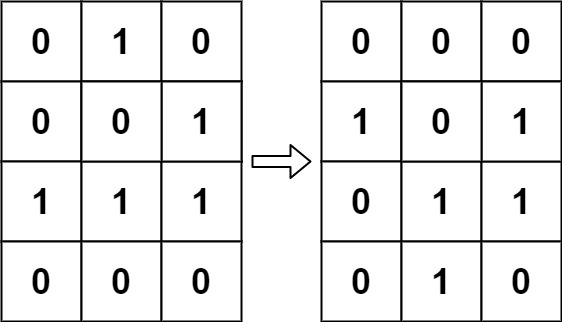
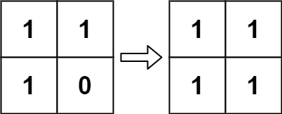
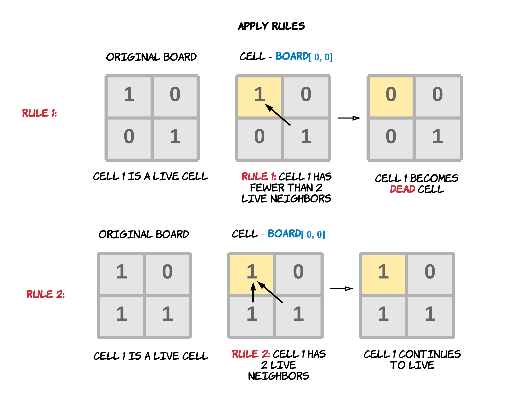
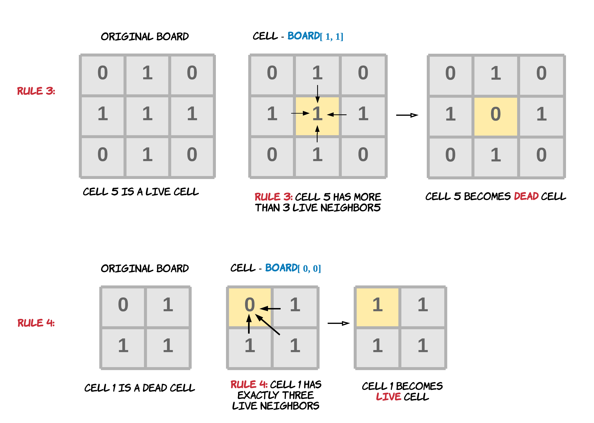
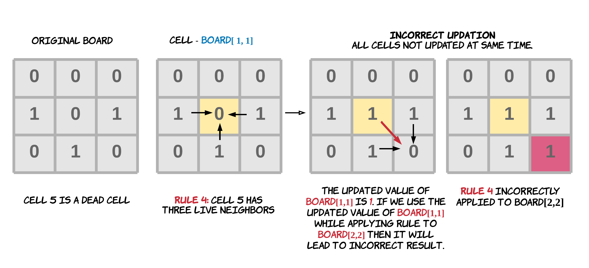
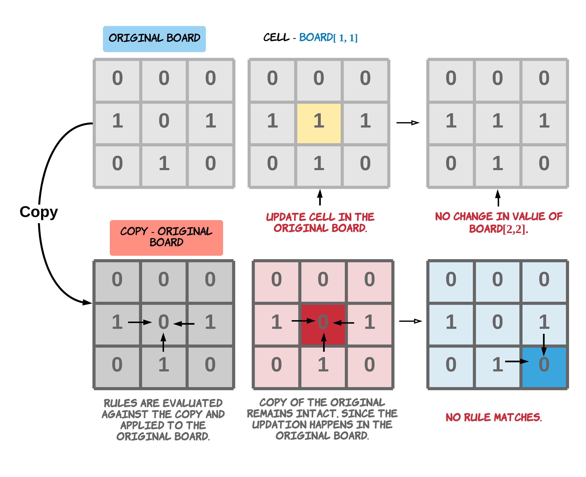
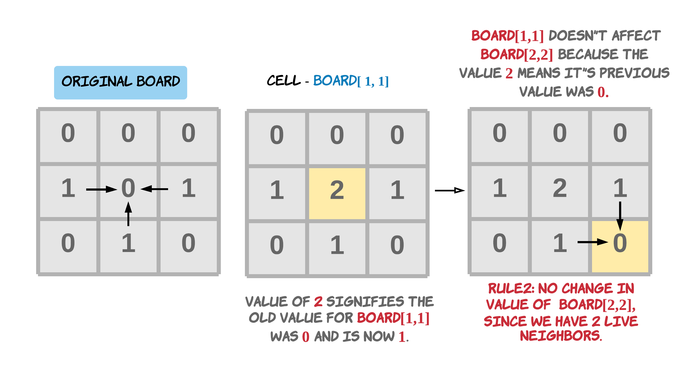

---
tags:
    - Array
    - Matrix
    - Simulation
    - Top Interviews
---

# [289. Game of Life](https://leetcode.com/problems/game-of-life/)

According to [Wikipedia's article](https://en.wikipedia.org/wiki/Conway's_Game_of_Life): "The **Game of Life**, also known simply as **Life**, is a cellular automaton devised by the British mathematician John Horton Conway in 1970."

The board is made up of an `m x n` grid of cells, where each cell has an initial state: **live** (represented by a `1`) or **dead** (represented by a `0`). Each cell interacts with its [eight neighbors](https://en.wikipedia.org/wiki/Moore_neighborhood) (horizontal, vertical, diagonal) using the following four rules (taken from the above Wikipedia article):

1. Any live cell with fewer than two live neighbors dies as if caused by under-population.
2. Any live cell with two or three live neighbors lives on to the next generation.
3. Any live cell with more than three live neighbors dies, as if by over-population.
4. Any dead cell with exactly three live neighbors becomes a live cell, as if by reproduction.

The next state of the board is determined by applying the above rules simultaneously to every cell in the current state of the `m x n` grid `board`. In this process, births and deaths occur **simultaneously**.

Given the current state of the `board`, **update** the `board` to reflect its next state.

**Note** that you do not need to return anything.

**Example 1:**



```
Input: board = [[0,1,0],[0,0,1],[1,1,1],[0,0,0]]
Output: [[0,0,0],[1,0,1],[0,1,1],[0,1,0]]
```

**Example 2:**



```
Input: board = [[1,1],[1,0]]
Output: [[1,1],[1,1]]
```

**Constraints:**

- `m == board.length`
- `n == board[i].length`
- `1 <= m, n <= 25`
- `board[i][j]` is `0` or `1`.

**Follow up:**

- Could you solve it in-place? Remember that the board needs to be updated simultaneously: You cannot update some cells first and then use their updated values to update other cells.
- In this question, we represent the board using a 2D array. In principle, the board is infinite, which would cause problems when the active area encroaches upon the border of the array (i.e., live cells reach the border). How would you address these problems?

**Solution:**





**Method 1:** 

The problem might look very easy at first, however, the most important catch in this problem is to realize that if you update the original array with the given rules, you won't be able to perform *simultaneous* updation as is required in the question. You might end up using the updated values for some cells to update the values of other cells. But the problem demands applying the given rules simultaneously to every cell.

Thus, you cannot update some cells first and then use their updated values to update other cells.



In the above diagram it's evident that an update to a cell can impact the other neighboring cells. If we use the updated value of a cell while updating its neighbors, then we are not applying rules to all cells simultaneously.

Here `simultaneously` isn't about parallelism but using the original values of the neighbors instead of the updated values while applying rules to any cell. Hence the first approach could be as easy as having a copy of the board. The copy is never mutated. So, you never lose the original value for a cell.

Whenever a rule is applied to any of the cells, we look at its neighbors in the unmodified copy of the board and change the original board accordingly. Here we keep the copy unmodified since the problem asks us to make the changes to the original array in-place.




**Algorithm**

1. Make a copy of the original board which will remain unchanged throughout the process.
2. Iterate the cells of the `Board` one by one.
3. While computing the results of the rules, use the copy board and apply the result in the original board.


```java
class Solution {
    public void gameOfLife(int[][] board) {
        int[][] directions = {{-1, -1}, {-1, 0}, {-1, 1},
                              {0, -1},           {0, 1},
                              {1, -1}, {1, 0}, {1,1}
        };

        int n = board.length;
        int m = board[0].length;

        int[][] copyBoard = new int[n][m];

        // Create a copy of the original board
        for (int i = 0; i < n; i++){
            for (int j = 0; j < m; j++){
                copyBoard[i][j] = board[i][j];
            }
        }

        // Iterate through board cell by cell.
        for (int i = 0; i < n; i++){
            for (int j = 0; j < m; j++){
                int liveNeighbors = 0;

                for (int[] dir : directions){
                    int newX = i + dir[0];
                    int newY = j + dir[1];

                    if (newX >= 0 && newX < n && newY >= 0 && newY < m && copyBoard[newX][newY] == 1){
                        liveNeighbors++;
                    }
                }
                // Rule 1 or Rule 3
                if (copyBoard[i][j] == 1 && (liveNeighbors < 2 || liveNeighbors > 3)){
                    board[i][j] = 0;
                }else if (copyBoard[i][j] == 0 && liveNeighbors == 3){
                  //                 // Rule 4
                    board[i][j] = 1;
                }
            }

        }
    }
}

// TC: O(n*m)
// SC: O(n*m)
```


```java
class Solution {
    public void gameOfLife(int[][] board) {
        // Neighbors array to find 8 neighboring cells for a given cell
        int[] neighbors = {0, 1, -1};

        int rows = board.length;
        int cols = board[0].length;

        // copyBoard
        int[][] copyBoard = new int[rows][cols];

        // Create a copy of the original board
        for (int row = 0; row < rows; row++){
            for (int col = 0; col < cols; col++){
                copyBoard[row][col] = board[row][col];
            }
        }

        // Iterate through board cell by cell.
        for (int row = 0; row < rows; row++){
            for (int col = 0; col < cols; col++){
                // For each cell count the number of live neighbors.
                int liveNeighbors = 0;

                for (int i = 0; i < 3; i++){
                    for (int j = 0; j < 3; j++){
                        if (!(neighbors[i] == 0 && neighbors[j] == 0)){
                            int r = (row + neighbors[i]);
                            int c = (col + neighbors[j]);
                            // Check the validity of the neighboring cell.
                            // and whether it was originally a live cell.
                            // The evaluation is done against the copy, since that is never updated.
                            if ((r < rows && r >= 0) && (c < cols && c >= 0) && (copyBoard[r][c] == 1)){
                                liveNeighbors = liveNeighbors + 1;
                            }
                        }
                    }
                }
                // Rule 1 or Rule 3
                if ((copyBoard[row][col] == 1) && (liveNeighbors < 2 || liveNeighbors > 3)){
                    board[row][col] = 0;
                }
                // Rule 4
                if (copyBoard[row][col] == 0 && liveNeighbors == 3){
                    board[row][col] = 1;
                }
            }

        }
    }
}

// TC: O(n*m)
// SC: O(n*m)
```

https://www.youtube.com/watch?v=fei4bJQdBUQ

**method2:**

Intuition

The problem could also be solved in-place. *O*(*M*×*N*) space complexity could be too expensive when the board is very large. We only have two states `live(1)` or `dead(0)` for a cell. We can use some dummy cell value to signify previous state of the cell along with the new changed value.

For e.g. If the value of the cell was `1` originally but it has now become `0` after applying the rule, then we can change the value to `-1`. The negative `sign` signifies the cell is now dead(0) but the `magnitude` signifies the cell was a live(1) cell originally.

Also, if the value of the cell was `0` originally but it has now become `1` after applying the rule, then we can change the value to `2`. The positive `sign` signifies the cell is now live(1) but the `magnitude` of 2 signifies the cell was a dead(0) cell originally.



**Algorithm**

1. Iterate the cells of the `Board` one by one.
2. The rules are computed and applied on the original board. The updated values signify both previous and updated value.
3. The updated rules can be seen as this:
   - Rule 1: Any live cell with fewer than two live neighbors dies, as if caused by under-population. Hence, change the value of cell to `-1`. This means the cell was live before but now dead.
   - Rule 2: Any live cell with two or three live neighbors lives on to the next generation. Hence, no change in the value.
   - Rule 3: Any live cell with more than three live neighbors dies, as if by over-population. Hence, change the value of cell to `-1`. This means the cell was live before but now dead. Note that we don't need to differentiate between the rule 1 and 3. The start and end values are the same. Hence, we use the same dummy value.
   - Rule 4: Any dead cell with exactly three live neighbors becomes a live cell, as if by reproduction. Hence, change the value of cell to 2. This means the cell was dead before but now live.
4. Apply the new rules to the board.
5. Since the new values give an indication of the old values of the cell, we accomplish the same results as approach 1 but without saving a copy.
6. To get the `Board` in terms of binary values i.e. live(1) and dead(0), we iterate the board again and change the value of a cell to a `1` if its value currently is greater than `0` and change the value to a `0` if its current value is lesser than or equal to `0`.

```java
class Solution {
    public void gameOfLife(int[][] board) {
        int[][] directions = {
            {-1, -1}, {-1, 0}, {-1, 1},
            {0, -1},           {0, 1},
            {1, -1},  {1, 0},  {1, 1}
        };

        int n = board.length;
        int m = board[0].length;

        // Step 1: Encode transitions in-place
        for (int i = 0; i < n; i++) {
            for (int j = 0; j < m; j++) {
                int liveNeighbors = 0;

                // Count live neighbors (based on original state)
                for (int[] dir : directions) {
                    int newX = i + dir[0];
                    int newY = j + dir[1];

                    if (newX >= 0 && newX < n && newY >= 0 && newY < m) {
                        // Original state alive? (1 or 2 means was alive)
                        if (board[newX][newY] == 1 || board[newX][newY] == 2) {
                            liveNeighbors++;
                        }
                    }
                }

                // Apply rules:
                // Rule 1 & 3: live cell with <2 or >3 neighbors → dies
                if (board[i][j] == 1 && (liveNeighbors < 2 || liveNeighbors > 3)) {
                    board[i][j] = 2; // live → dead
                }
                // Rule 4: dead cell with exactly 3 neighbors → becomes alive
                else if (board[i][j] == 0 && liveNeighbors == 3) {
                    board[i][j] = 3; // dead → live
                }
            }
        }

        // Step 2: Finalize transitions
        for (int i = 0; i < n; i++) {
            for (int j = 0; j < m; j++) {
                if (board[i][j] == 2) {
                  board[i][j] = 0; // died
          			}else if (board[i][j] == 3) {
                  board[i][j] = 1; // revived
                }
            }
        }
    }
}

// TC: O(n*m)
// SC: O(1)
```

