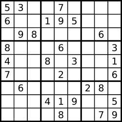

---
tags:
    - Array
    - Hash Table
    - Matrix
    - Top Interviews
---

# [36. Valid Sudoku](https://leetcode.com/problems/valid-sudoku/)

Determine if a `9 x 9` Sudoku board is valid. Only the filled cells need to be validated **according to the following rules**:

1. Each row must contain the digits `1-9` without repetition.
2. Each column must contain the digits `1-9` without repetition.
3. Each of the nine `3 x 3` sub-boxes of the grid must contain the digits `1-9` without repetition.

**Note:**

- A Sudoku board (partially filled) could be valid but is not necessarily solvable.
- Only the filled cells need to be validated according to the mentioned rules.

 

**Example 1:**



```
Input: board = 
[["5","3",".",".","7",".",".",".","."]
,["6",".",".","1","9","5",".",".","."]
,[".","9","8",".",".",".",".","6","."]
,["8",".",".",".","6",".",".",".","3"]
,["4",".",".","8",".","3",".",".","1"]
,["7",".",".",".","2",".",".",".","6"]
,[".","6",".",".",".",".","2","8","."]
,[".",".",".","4","1","9",".",".","5"]
,[".",".",".",".","8",".",".","7","9"]]
Output: true
```

**Example 2:**

```
Input: board = 
[["8","3",".",".","7",".",".",".","."]
,["6",".",".","1","9","5",".",".","."]
,[".","9","8",".",".",".",".","6","."]
,["8",".",".",".","6",".",".",".","3"]
,["4",".",".","8",".","3",".",".","1"]
,["7",".",".",".","2",".",".",".","6"]
,[".","6",".",".",".",".","2","8","."]
,[".",".",".","4","1","9",".",".","5"]
,[".",".",".",".","8",".",".","7","9"]]
Output: false
Explanation: Same as Example 1, except with the 5 in the top left corner being modified to 8. Since there are two 8's in the top left 3x3 sub-box, it is invalid.
```

 

**Constraints:**

- `board.length == 9`
- `board[i].length == 9`
- `board[i][j]` is a digit `1-9` or `'.'`.

**Solution:**

我们需要满足三个规则：

1. 每行不能有相同数字。
2. 每列不能有相同数字。
3. 每宫不能有相同数字。**注**：宫是大小为 3×3 的子矩阵。

对于宫，我们可以把 board 视作 3×3 个大小为 3×3 的子矩阵。其中 $board[i][j]$ 在$(\left \lfloor  \frac{i}{3} \right \rfloor, \left \lfloor \frac{j}{3} \right \rfloor)$ 这个宫。例如右下角 $board[8][8]$ 在
$$
(\left \lfloor \frac{8}{3} \right \rfloor, \left \lfloor \frac{8}{3} \right \rfloor) = (2,2)
$$
这个宫, 即右下的$3 \times 3$子矩阵.

判断是否满足规则：

1. 对于每行，在遍历的同时，用二维布尔数组 $rowHas$ 标记遍历过的数字，其中 $rowHas[i][x]=true$ 表示第 $i$ 行有数字 $x$。比如之前遍历到数字$6$，标记 $rowHas[i][6]=true$；然后又遍历到数字 $6$，发现 $rowHas[i][6]=true$，则说明有两个 $6$，数独不是有效的，返回 $false$。
2. 对于每列，在遍历的同时，用二维布尔数组 colHas 标记遍历过的数字，其中 $colHas[j][x]=true$ 表示第 $j$ 列有数字 $x$。如果继续遍历，遍历到相同数字，即发现 $colHas[j][x]=true$，那么数独不是有效的，返回 $false$。
3. 对于每宫，在遍历的同时，用三维布尔数组 $subBoxHas$ 标记遍历过的数字。设 $i'=\left \lfloor \frac{i}{3} \right \rfloor$, $j' = \left \lfloor \frac{j}{3} \right \rfloor$, 定义$subBoxHas[i'][j'][x] =true$ 表示$(i',j')$ 宫有数字$x$. 如果继续遍历, 遍历到相同数字, 即发现$subBoxHas[i'][j'][x] = true$, 那么数独不是有效的, 返回$false$.

如果遍历过程中没有返回 false，那么数独是有效的，最终返回 $true$。

```java
class Solution {
    public boolean isValidSudoku(char[][] board) {
       boolean[][] rowHas = new boolean[9][9]; // rowHas[i][x] 表示 i 行是否有数字 x
       boolean[][] colHas = new boolean[9][9]; // colHas[j][x] 表示 j 列是否有数字 x
       boolean[][][] subBoxHas = new boolean[3][3][9]; // subBoxHas[i'][j'][x] 表示 (i',j') 宫是否有数字 x

       for (int i = 0; i < 9; i++){
        for (int j = 0; j < 9; j++){
            char b = board[i][j];
            if (b == '.'){
                continue;
            }

            int x = b - '1'; // 字符'1' ~ '9' 转成数字 0~8
            if (rowHas[i][x] || colHas[j][x] || subBoxHas[i / 3][j / 3][x]){ // 重复遇到数字 x
                return false;
            }

            // 标记行、列、宫包含数字 x
            rowHas[i][x] = true; 
            colHas[j][x] = true; 
            subBoxHas[i / 3][j / 3][x] = true;
        }
       }

       return true; 
    }
}

// TC: O(n^2), 其中 n=9 是 board 的长度。
// SC: O(n^2)
```


```java
class Solution {
    public boolean isValidSudoku(char[][] board) {
        Set<String> seen = new HashSet<String>();

        for (int i = 0; i < 9; i++){
            for (int j = 0; j < 9; j++){
                if (board[i][j] != '.'){
                    String b = "(" + board[i][j] + ")";

                    if (!seen.add(b + i) || !seen.add(j + b) || !seen.add(i /3  + b +  j/3)){
                        return false;
                    }

                    // 1.Check block validation
                    // 2.Check row validation
                    // 3.Check column validation
                }
            
            }
        }

        return true;
    }
}
```


