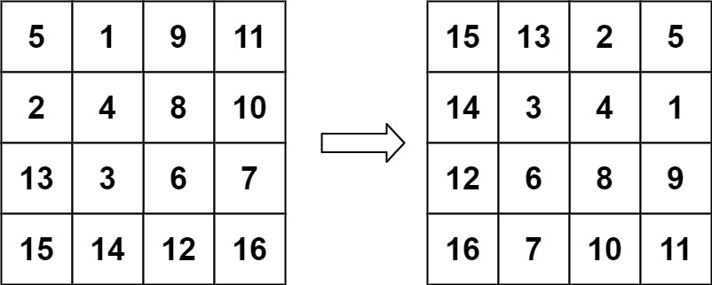
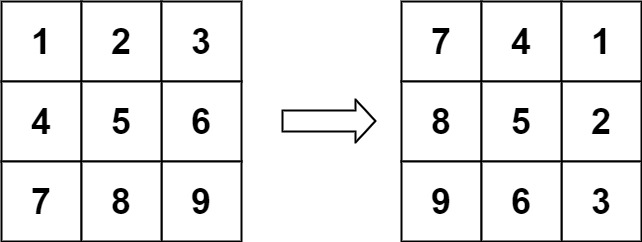

---
tags:
    - Array
    - Math
    - Matrix
    - Top Interviews
---

# [48. Rotate Image](https://leetcode.com/problems/rotate-image/)

You are given an `n x n` 2D `matrix` representing an image, rotate the image by **90** degrees (clockwise).

You have to rotate the image [**in-place**](https://en.wikipedia.org/wiki/In-place_algorithm), which means you have to modify the input 2D matrix directly. **DO NOT** allocate another 2D matrix and do the rotation.

 

**Example 1:**


```
Input: matrix = [[1,2,3],[4,5,6],[7,8,9]]
Output: [[7,4,1],[8,5,2],[9,6,3]]
```


**Example 2:**



```
Input: matrix = [[5,1,9,11],[2,4,8,10],[13,3,6,7],[15,14,12,16]]
Output: [[15,13,2,5],[14,3,4,1],[12,6,8,9],[16,7,10,11]]
```

 

**Solution:**

Problem statement:

Rotate an $n \times n$ matrix (square matrix) 90 degrees clockwise.

Requirement:

You are not allowed to create another matrix -- the space complexity must be $O(1)$.


Anlysis:



After rotating 90° clockwise, where does the element at position(i, j) move to?

Vertically:

- The 1st column becomes the 1st row.
- The 2nd column becomes the 2nd row.
- …
- The j-th column becomes the j-th row.

Horizontally:

- The 1st row becomes the last column.
- The 2nd row becomes the second-to-last column.
- …
- The i-th row becomes the (n − 1 − i)-th column.

Therefore,
$$
(i, j) \rightarrow (j, n - 1 - i)
$$
When a square matrix $(n \times n)$ is rotated 90° clockwise, the element originally at position $(i, j)$ moves to position$(j, n - 1 - i)$.


**Two flips = one rotation**

The transformation **(i, j) → (j, n − 1 − i)** can be achieved by **two in-place flips**:

1. **Transpose** — swap across the main diagonal
   $$
   (i, j) \rightarrow (j, i)
   $$

2. **Horizontal flip** — reverse each row
   $$
   (j, i) \rightarrow (j, n - 1 - i)
   $$

**Example:**

Original matrix:
$$
\begin{bmatrix}
1 & 4 & 7 \\
2 & 5 & 8 \\
3 & 6 & 9
\end{bmatrix}
$$
**After transpose:**
$$
\begin{bmatrix}
1 & 2 & 3 \\
4 & 5 & 6 \\
7 & 8 & 9
\end{bmatrix}
$$
**After horizontal flip:**
$$
\begin{bmatrix}
7 & 8 & 9 \\
4 & 5 & 6 \\
1 & 2 & 3
\end{bmatrix}
$$

> Any rotation about a point can be represented by two reflections.
>  For a 90° clockwise rotation, reflecting about the main diagonal and then about the vertical middle axis produces the same effect.

**Implementation idea**

- **Step 1:** Transpose — for all `i < j`, swap `matrix[i][j]` with `matrix[j][i]`.
- **Step 2:** Reverse each row — swap `row[j]` with `row[n−1−j]`.

Both steps are **in-place**, so the **space complexity is O(1)**.

```java
class Solution {
    public void rotate(int[][] matrix) {
        int n = matrix.length;
        // transpose
        for (int i = 0; i < n; i++){
            for (int j = 0; j < i; j++){
                int tmp = matrix[i][j];
                matrix[i][j] = matrix[j][i];
                matrix[j][i] = tmp;
            }
        }

        // horizontal flip
        for (int[] row : matrix){
            for (int j = 0; j < n/2; j++){
                int tmp = row[j];
                row[j] = row[n - 1 - j];
                row[n - 1 - j] = tmp;
            }
        }
    }
}

// TC: O(n^2)
// SC: O(1)
```


```java
class Solution {
    public void rotate(int[][] matrix) {
        int n = matrix.length;

        for (int round = 0; round < n/2; round++){ 
            int left = round;
            int right = n - 1 - round;
            int up = round;
            int down = n - 1 - round;

            int gap = right - left;

            for (int i = 0; i < gap; i++){
                int cur = matrix[up][left + i];

                matrix[up][left + i] = matrix[down - i][left];

                matrix[down - i][left] = matrix[down][right -i];
                matrix[down][right - i] = matrix[up+i][right];
                matrix[up + i][right] = cur;

            }
        }

        return;

    }
}

// TC: O(n^2)
// SC: O(1)
// 有个一个不动 就边界值, 有个动就和i相关
```


不难但很烦

```java
class Solution {
    public void rotate(int[][] matrix) {
        int n = matrix.length;
        if (n <= 1){
            return; 
        }

        for (int round = 0; round < n/2; round++){
            int left = round;
            int right = n - 1 - round; // 4 - 1 = 3 - 1 =2 
            int up = round; // up = left
            int down = n - 1 - round; // down = right

            for (int i = left; i < right; i++){
                int tmp = matrix[up][i];
                // down -> up
                matrix[up][i] = matrix[n - 1 - i][left];

                // right -> left
                matrix[n - 1 - i][left] = matrix[down][n-1-i];

                // up -> down
                matrix[down][n-1-i] = matrix[i][right];

                // left -> right

                matrix[i][right] = tmp;
            }

        }
    }
}

// TC: O(n^2)
// SC: O(1)
```


Method 2: 必须保证正方形

[1, 2, 3],

[4, 5, 6],

[7, 8, 9]

Step 1: 对角线交换

[1, 4, 7],

[2, 5, 8],

[3, 6, 9]

Step 2: 以中轴左swap 左右reverse每一行

[7, 4, 1],

[8, 5, 2],

[9, 6, 3]


**solution 2:**

```java
class Solution {
    public void rotate(int[][] matrix) {
       int n = matrix.length; 
       if (n <= 1){
           return;
       } 

       // Step 1 对角线交换
       for (int i = 0; i < n; i++){
           for (int j = i; j < n; j++){
               int tmp = matrix[i][j];
               matrix[i][j] = matrix[j][i];
               matrix[j][i] = tmp;
           }
       } 

       // Step 2 以中轴左swap 左右 reverse每一行
       for (int i = 0; i < n; i++){
           for (int j = 0; j < n/2; j++){
               int tmp = matrix[i][j];
               matrix[i][j] = matrix[i][n - j - 1];
               matrix[i][n - j - 1] = tmp;
           }
       }
    }
}

//TC: O(n^2)
//SC: O(1)
```


