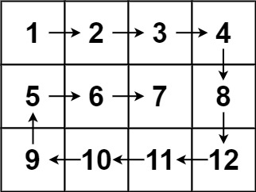

---
tags:
    - Array
    - Matrix
    - Simulation
    - Top Interviews
---

# [54. Spiral Matrix](https://leetcode.com/problems/spiral-matrix/)

Given an `m x n` `matrix`, return *all elements of the* `matrix` *in spiral order*.

**Example 1:**


```
Input: matrix = [[1,2,3],[4,5,6],[7,8,9]]
Output: [1,2,3,6,9,8,7,4,5]
```

**Example 2:**



```
Input: matrix = [[1,2,3,4],[5,6,7,8],[9,10,11,12]]
Output: [1,2,3,4,8,12,11,10,9,5,6,7]
```


**Solution:** 

**总体思路**

根据题意，我们从左上角 (0,0) 出发，按照「右下左上」的顺序前进：

* 首先向右走，如果到达矩阵边界，则向右转 90, 前进方向变为向下。
* 然后向下走，如果到达矩阵边界，则向右转 90, 前进方向变为向左。
* 然后向左走，如果到达矩阵边界，则向右转 90, 前进方向变为向上。
* 然后向上走，先从 7 走到 4，然后从 4 准备向上走，但上面的 1 是一个已经访问过的数字，那么向右转 90, 前进方向变为向右。
* 重复上述过程，直到答案的长度为 mn。


**方法一：标记**

1. 对于已经访问过的数字，可将其标记为 ∞ 或者空，从而避免重复访问。
2. 用一个长为 4 的方向数组 $DIRS=[(0,1),(1,0),(0,−1),(−1,0)]$ 分别表示右下左上 4 个方向。同时用一个下标 $di$ 表示当前方向，初始值为 0，表示一开始向右。
3. 每次移动，相当于把行号增加 $DIRS[di][0]$，把列号增加 $DIRS[di][1]$。
4. 向右转 90，相当于把 $di$ 增加 1，但在 $di=3$ 时要回到 $di=0$。两种情况合二为一，把 $di$ 更新为 $(di+1) \mod 4$。

```java
class Solution {
    private static final int[][] DIRS = {{0, 1}, {1, 0}, {0, -1}, {-1, 0}}; // 右下左上

    public List<Integer> spiralOrder(int[][] matrix) {
        int m = matrix.length;
        int n = matrix[0].length;
        List<Integer> ans = new ArrayList<>(m * n); // 预分配空间
        int i = 0;
        int j = 0;
        int di = 0;
        for (int k = 0; k < m * n; k++) { // 一共走 mn 步
            ans.add(matrix[i][j]);
            matrix[i][j] = Integer.MAX_VALUE; // 标记，表示已经访问过（已经加入答案）
            int x = i + DIRS[di][0];
            int y = j + DIRS[di][1]; // 下一步的位置
            // 如果 (x, y) 出界或者已经访问过
            if (x < 0 || x >= m || y < 0 || y >= n || matrix[x][y] == Integer.MAX_VALUE) {
                di = (di + 1) % 4; // 右转 90°
            }
            i += DIRS[di][0];
            j += DIRS[di][1]; // 走一步
        }
        return ans;
    }
}


// 时间复杂度：O(mn)，其中 m 和 n 分别为 matrix 的行数和列数。
// 空间复杂度：O(1)。返回值不计入。
```


**方法二：不标记**

上面的做法需要修改 *matrix*，能否不修改呢？

示例 2 这 12 个数字，可以分为以下 5 组：

* 1→2→3→4

* 8→12

* 11→10→9

* 5

* 6→7

  

其中第 1,3,5 组都是向右或者向左走的，长度依次为 4,3,2，这是一个从 n=4 开始的逐渐递减的序列。

其中第 2,4 组都是向下或者向上走的，长度依次为 2,1，这是一个从 m−1=2 开始的逐渐递减的序列。

由于走的步数是有规律的，我们可以精确地控制在每个方向上要走多少步，无需判断是否出界、是否重复访问：

* 从 (0,−1) 开始。
* 一开始，向右走 n 步，每次先走一步，再把数字加入答案。走 n 步即 1→2→3→4，矩阵第一排的数都加入了答案。
* 然后向下走 m−1 步，即 8→12。
* 然后向左走 n−1 步，即 11→10→9。
* 然后向上走 m−2 步，即 5。
* 然后向右走 n−2 步，即 6→7。
* 重复上述过程，直到答案的长度等于 mn。
  

代码实现时，可以这样简化代码：

* 一开始走 n 步。
* 把 n,m 分别更新为 m−1,n，这样下一轮循环又可以走 n 步（相当于走了 m−1 步），无需修改其他逻辑。
* 把 n,m 分别更新为 m−1,n，这样下一轮循环又可以走 n 步（相当于走了 n−1 步）。
* 把 n,m 分别更新为 m−1,n，这样下一轮循环又可以走 n 步（相当于走了 m−2 步）。
* 依此类推，每次只需把 n,m 分别更新为 m−1,n 即可。


**答疑**
问：如何说明这个规律的正确性？

**答**：在上文的例子中，我们把示例 2 分成了 5 组。一般地，每 4 组，我们会把矩阵最外面一圈去掉（就像剥洋葱），矩阵的行数会减少 2，列数会减少 2。所以行列的减少是有规律的。

```java
// TC: O(mn)，其中 m 和 n 分别为 matrix 的行数和列数。
// SC: O(1)。返回值不计入。
```

**思考题**

假如 $m \leq 10^9, n \leq 10^9$. 

输出走了 $k$ 步之后，你所在的格子的坐标（行列编号）。

你能用 $O(log)$ 或者 $O(1)$ 时间解决吗？


```java
class Solution {
    public List<Integer> spiralOrder(int[][] matrix) {
        List<Integer> result = new ArrayList<Integer>();
        int row = matrix.length; // 3
        int col = matrix[0].length; // [1,2,3,4] 4
        // base case
        if (row == 0 || col == 0){
            return result;
        }

        if (row == 1){
            // [[1,2,3,4]]
            for (int i = 0; i < col; i++){
                result.add(matrix[row-1][i]);
            }
            return result;
        }

        if (col == 1){
            // [[1] [2] [3]]
            for (int i = 0; i < row; i++){
                result.add(matrix[i][col-1]);
            }
            return result;
        }

        // index
        int left = 0;
        int right = col - 1;
        int up = 0;
        int down =  row - 1;

        while(left < right && up < down){

            // left -> right
            for (int i = left; i < right; i++){
                result.add(matrix[up][i]);
            }
            
            // up -> down
            for (int j = up; j < down; j++){
                result.add(matrix[j][right]);
            }

            // right->left
            for (int i = right; i > left; i--){
                result.add(matrix[down][i]);
            }

            // down -> up
            for (int j = down; j > up; j--){
                result.add(matrix[j][left]);
            }

            left++;
            right--;
            up++;
            down--;
        }

        // if there is nothing left
        if (left > right || up > down){
            return result;
        }

        // if there is left  
        // one col or one row
        if (left == right){
            // col
            for (int i = up; i <= down; i++){
                result.add(matrix[i][left]);
            }
        }else{
            // row
            for (int i = left; i <= right; i++){
                result.add(matrix[up][i]);
            }
        }
        return result;
    }
}

// TC: O(n)
// SC: O(1)
```


```java
class Solution {
    public List<Integer> spiralOrder(int[][] matrix) {

        List<Integer> result = new ArrayList<Integer>();

        int row = matrix.length;
        int col = matrix[0].length;

        int left = 0;
        int right = col - 1;
        int up = 0;
        int down = row - 1;


        while(left < right && up < down){
            for (int i = left; i < right; i++){
                result.add(matrix[up][i]);
            }

            for (int j = up; j < down; j++){
                result.add(matrix[j][right]);
            }

            for (int i = right; i > left; i--){
                result.add(matrix[down][i]);
            }

            for (int j = down; j > up; j--){
                result.add(matrix[j][left]);
            }

            left++;
            right--;
            up++;
            down--;
        }

        if (left > right || up > down){
            return result;
        }

        if (left == right){
            for (int i = up; i <= down; i++){
                result.add(matrix[i][left]);
            }
        }else {
            for (int i = left; i <= right; i++){
                result.add(matrix[up][i]);
            }
        }
        return result;
    }
}


// TC: O(n)
// SC: O(1)
```


