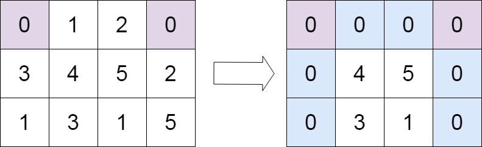
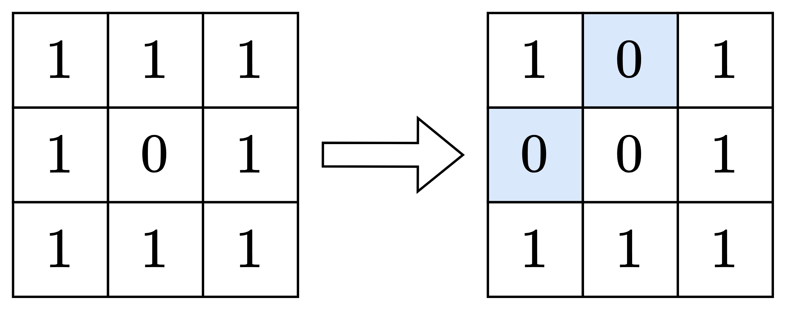

---
tags:
    - Array
    - Hash Table
    - Matrix
    - Top Interviews
---

# [73. Set Matrix Zeroes](https://leetcode.com/problems/set-matrix-zeroes/)

Given an `m x n` integer matrix `matrix`, if an element is `0`, set its entire row and column to `0`'s.

You must do it [in place](https://en.wikipedia.org/wiki/In-place_algorithm). 

**Example 1:**


```
Input: matrix = [[1,1,1],[1,0,1],[1,1,1]]
Output: [[1,0,1],[0,0,0],[1,0,1]]
```

**Example 2:**



```
Input: matrix = [[0,1,2,0],[3,4,5,2],[1,3,1,5]]
Output: [[0,0,0,0],[0,4,5,0],[0,3,1,0]]
```

 

**Constraints:**

- `m == matrix.length`
- `n == matrix[0].length`
- `1 <= m, n <= 200`
- `-231 <= matrix[i][j] <= 231 - 1`

 

**Follow up:**

- A straightforward solution using `O(mn)` space is probably a bad idea.
- A simple improvement uses `O(m + n)` space, but still not the best solution.
- Could you devise a constant space solution?


**Solution:**

This article starts with an approach that uses **O(m + n)** extra space, and then optimizes it to **O(1)** space.

**Rule**

For `matrix[i][j]`, if the **i-th row** contains a 0 or the **j-th column** contains a 0, then set `matrix[i][j] = 0`; otherwise, keep `matrix[i][j]` unchanged (still 1).


**Method 1: Using Extra Arrays**

Use a Boolean array `rowHasZero` of length $m$ to record whether each row contains a 0.

- Traverse each row `matrix[i]`. If it contains a 0, set `rowHasZero[i] = true`.

Use another Boolean array `colHasZero` of length *n* to record whether each column contains a 0.

- Traverse each column `j` of the matrix. If it contains a 0, set `colHasZero[j] = true`.

Then, traverse the matrix again. For each `matrix[i][j]`, if `rowHasZero[i] == true` or `colHasZero[j] == true`, it means that row *i* or column *j* contains a 0 so set `matrix[i][j] = 0`.

**Q&A**

**Q:** Can we directly set the entire row *i* and column *j* to 0 when we find that `matrix[i][j] = 0`?

**A:** No, that would be incorrect.

For example, in Example 1, if we immediately turn an entire row and column into 0s, then when we continue traversing and later encounter `matrix[1][2] = 0`, we would mistakenly think that this element was originally 0 — and incorrectly turn the entire 2nd column (the rightmost column) into 0s.


```java
class Solution {
    public void setZeroes(int[][] matrix) {
       int n = matrix.length;
       int m = matrix[0].length;

       Set<Integer> rowHasZero = new HashSet<>();
       Set<Integer> colHasZero = new HashSet<>();

       for (int i = 0; i < n; i++){
        for (int j = 0; j < m; j++){
            if (matrix[i][j] == 0){
                rowHasZero.add(i);
                colHasZero.add(j);
            }
        }
       } 

       for (int i = 0; i < n; i++){
        for (int j = 0; j < m; j++){
            if (rowHasZero.contains(i) || colHasZero.contains(j)){
                matrix[i][j] = 0;
            }
        }
       }

       return;
    }
}

// TC: O(nm)
// SC: O(n+m)
```


```java
class Solution {
    public void setZeroes(int[][] matrix) {
        int row = matrix.length;
        int col = matrix[0].length;
        Set<Integer> rows = new HashSet<Integer>();
        Set<Integer> cols = new HashSet<Integer>();

        for (int i = 0; i < row; i++){
            for (int j = 0; j < col; j++){
                if (matrix[i][j] == 0){
                    rows.add(i);
                    cols.add(j);
                }
            }
        }

        for (int i = 0; i < row; i++){
            for (int j = 0; j < col; j++){
                if (rows.contains(i) || cols.contains(j)){
                    matrix[i][j] = 0;
                }
            }
        }
    }
}

// TC:O(m*n)
// SC:O(m+n)
```


**Method 2: Without Using Extra Arrays**

Consider storing the data in the first row and first column of the matrix, similar to how the first row and column in an Excel sheet store summary information.

Use the first column `matrix[i][0]` to store `rowHasZero[i]`: 

* If the *i*-th row contains a zero, set `matrix[i][0] = 0`.

Use the first row `matrix[0][j]` to store `colHasZero[j]`:

* If the *j*-th column contains a zero, set `matrix[0][j] = 0`.

Then, traverse the matrix again. For each element `matrix[i][j]`, if `matrix[i][0] == 0` or `matrix[0][j] == 0`, it means that row *i* or column *j* originally contained a zero, so set `matrix[i][j] = 0`.

At first glance, this seems to solve the problem.

However, once we modify `matrix[0][j] = 0`, we lose the information about whether the *first row* initially contained a zero.

For example, in Example 1, the first row was all 1’s at the beginning. After recording the zero markers, it now contains zeros. If we mistakenly assume that “the first row originally contained a zero,” we will end up setting the entire first row to zero.

The same issue applies to `matrix[i][0] = 0`: after modification, we lose information about whether the *first column* initially contained a zero.

So how can we fix this bug?



Solution: At the beginning, use two additional boolean variables to record whether the first row and the first column contain any zeros. Finally, if the first row originally contained a zero, set the entire first row to zero; if the first column originally contained a zero, set the entire first column to zero.

Since the first row and first column will be handled separately at the end, we should skip them when modifying `matrix[i][j]`. This also avoids another bug: if we set `matrix[i][0]` to zero too early, we might mistakenly think that the entire *i*-th row should be set to zero.

```java
class Solution {
    public void setZeroes(int[][] matrix) {
        int m = matrix.length;
        int n = matrix[0].length;

        // 记录第一行是否包含 0
        boolean firstRowHasZero = false; 
        for (int x : matrix[0]) {
            if (x == 0) {
                firstRowHasZero = true;
                break;
            }
        }

        // 记录第一列是否包含 0
        boolean firstColHasZero = false; 
        for (int i = 0; i < m; i++) {
            if (matrix[i][0] == 0) {
                firstColHasZero = true;
                break;
            }
        }

        // 用第一列 matrix[i][0] 保存 rowHasZero[i]
        // 用第一行 matrix[0][j] 保存 colHasZero[j]
        for (int i = 1; i < m; i++) { // 无需遍历第一行，如果 matrix[0][j] 本身是 0，那么相当于 colHasZero[j] 已经是 true
            for (int j = 1; j < n; j++) { // 无需遍历第一列，如果 matrix[i][0] 本身是 0，那么相当于 rowHasZero[i] 已经是 true
                if (matrix[i][j] == 0) {
                    matrix[i][0] = 0; // 相当于 rowHasZero[i] = true
                    matrix[0][j] = 0; // 相当于 colHasZero[j] = true
                }
            }
        }

        for (int i = 1; i < m; i++) { // 跳过第一行，留到最后修改
            for (int j = 1; j < n; j++) { // 跳过第一列，留到最后修改
                if (matrix[i][0] == 0 || matrix[0][j] == 0) { // i 行或 j 列有 0
                    matrix[i][j] = 0;
                }
            }
        }

        // 如果第一列一开始就包含 0，那么把第一列全变成 0
        if (firstColHasZero) {
            for (int[] row : matrix) {
                row[0] = 0;
            }
        }

        // 如果第一行一开始就包含 0，那么把第一行全变成 0
        if (firstRowHasZero) {
            Arrays.fill(matrix[0], 0);
        }
    }
}
```


