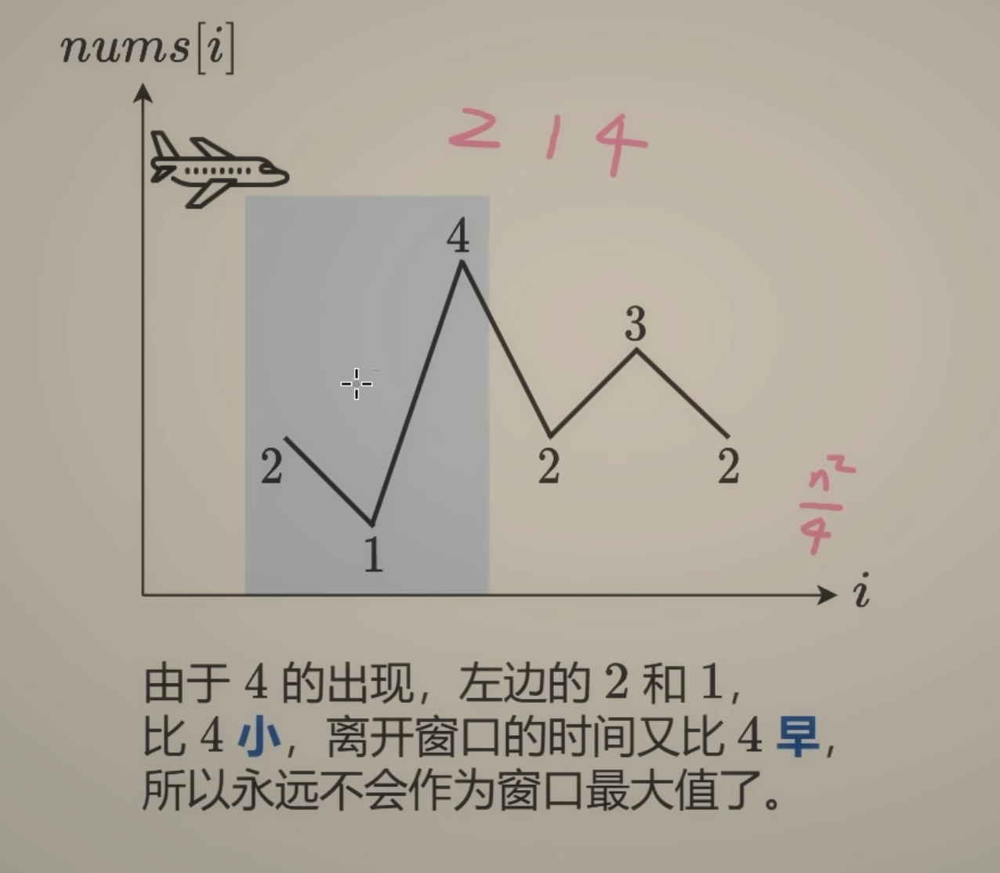

---
tags:
    - Array
    - Queue
    - Sliding Window
    - Heap (Priority Queue)
    - Monotonic Queue
    - Microsoft
---

# [239. Sliding Window Maximum](https://leetcode.com/problems/sliding-window-maximum/)

You are given an array of integers `nums`, there is a sliding window of size `k` which is moving from the very left of the array to the very right. You can only see the `k` numbers in the window. Each time the sliding window moves right by one position.

Return *the max sliding window*.

 

**Example 1:**

```
Input: nums = [1,3,-1,-3,5,3,6,7], k = 3
Output: [3,3,5,5,6,7]
Explanation: 
Window position                Max
---------------               -----
[1  3  -1] -3  5  3  6  7       3
 1 [3  -1  -3] 5  3  6  7       3
 1  3 [-1  -3  5] 3  6  7       5
 1  3  -1 [-3  5  3] 6  7       5
 1  3  -1  -3 [5  3  6] 7       6
 1  3  -1  -3  5 [3  6  7]      7
```

**Example 2:**

```
Input: nums = [1], k = 1
Output: [1]
```


**Solution:**

```java
class Solution {
    public int[] maxSlidingWindow(int[] nums, int k) {
        // Assumptions: array is not null or not empty,
        // k >= 1 and k <= a.length.
        List<Integer> max = new ArrayList<Integer>();
        // use a descending deque to solve this problem,
        // we store the index instead of the actual value in the deque,
        // and we make sure:
        // 1. the deque only contains index in the current sliding window.
        // 2. for any index, the previous index with smaller value is 
        // discarded from the deque.
        Deque<Integer> deque = new LinkedList<Integer>();
        for (int i = 0; i < nums.length; i++){
            // discard any index with smaller value than index i.
            while(!deque.isEmpty() && nums[deque.peekLast()] <= nums[i]){
                deque.pollLast();
            }
            // it is possible the head element is out of the current
            // sliding window so we might need to discard it as well.
            if (!deque.isEmpty() && deque.peekFirst() <= i - k){
                deque.pollFirst();
            }
            deque.offerLast(i);
            if (i >= k - 1){
                max.add(nums[deque.peekFirst()]);
            }

        }
        int[] result = new int[max.size()];
        for (int i = 0; i < max.size(); i++){
            result[i] = max.get(i);
        }

        return result;
        
    }
}

// TC: O(n)
// SC: O(n)
```


```java
class Solution {
    public int[] maxSlidingWindow(int[] nums, int k) {
        int[] result = new int[nums.length - k + 1];
        // List<Integer> max = new ArrayList<Integer>();

        Deque<Integer> deque = new LinkedList<Integer>();

        for (int i = 0; i < nums.length; i++){
            while(!deque.isEmpty() && nums[deque.peekLast()] <= nums[i]){
                deque.pollLast();
            }


            // size
            if (!deque.isEmpty() && deque.peekFirst() <= i - k){ //     2 - 3 = -1
                deque.pollFirst();
            }


            deque.offerLast(i);
            if (i >= k - 1){//2>= 3 -1 =2  // make sure a sliding window size
                //  max.add(nums[deque.peekFirst()]);
                result[i -k + 1] = nums[deque.peekFirst()]; 
            }


        }


        /*
                     0 1  2  3 4 5 6 7
                                     i
                    [1,3,-1,-3,5,3,6,7], k = 3
  

        deque:   first   <-   7  ->   last
        max: 3, 3 , 5, 5,6 , 7
        */


        // int[] result = new int[max.size()];
        // for (int i = 0; i < max.size(); i++){
        //     result[i] = max.get(i);
        // }

        return result;

    }
}

// TC: O(n)
// SC: O(n)
```




单调队列:

* 双端队列
  * 移除最左边的元素
  * 移除最右边的元素
  * 在最右边插入元素
* 单调性
  * 从队首到队尾单调递减

```java
class Solution {
    public int[] maxSlidingWindow(int[] nums, int k) {
        int n = nums.length;
        int[] result = new int[n - k + 1];
        Deque<Integer> queue = new ArrayDeque<>();
				// 从左到右严格递减
        for (int i = 0; i < n; i++){
            // 1. 入(元素进入队尾, 同时维护队列单调性)
            while(!queue.isEmpty() && nums[queue.peekLast()] <= nums[i]){
                queue.pollLast();
            }
            queue.offerLast(i);
            // 2. 出(元素离开队首)
            if (i - queue.peekFirst() >= k){
                queue.pollFirst();
            }
            // 3. 记录/维持答案(根据队首)
            if (i >= k - 1){
                result[i - k + 1] = nums[queue.peekFirst()]; 
            }
        }
        return result;
    }
}

// TC: O(n)
// SC: O(n)
```

及时去掉无用数据, 保证双端队列有序

* 当前数字$\geq$ 队尾, 弹出队尾(和单调栈一样)
* 弹出队首不在窗口内的元素


https://www.bilibili.com/video/BV1bM411X72E/?vd_source=73e7d2c4251a7c9000b22d21b70f5635
