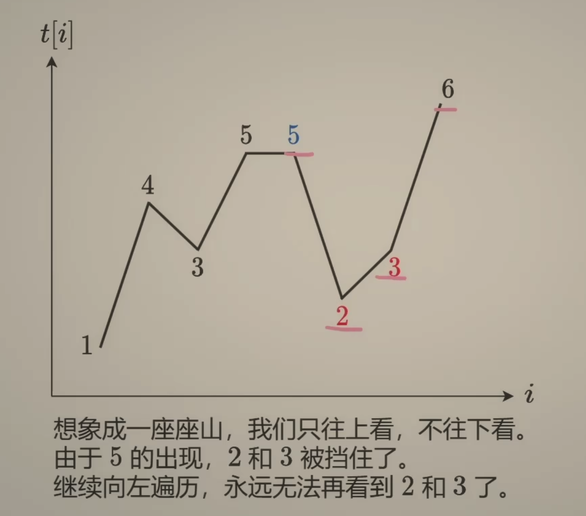
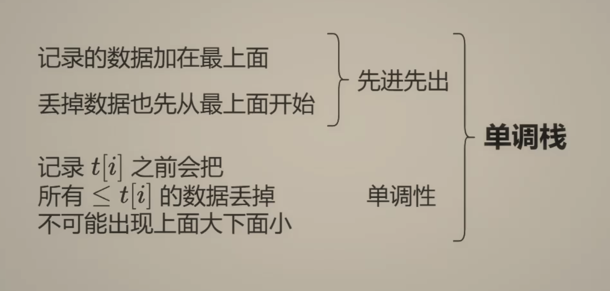

---
tags:
    - Array
    - Stack
    - Monotonic Stack
    - Top Interviews
---

# [739. Daily Temperatures](https://leetcode.com/problems/daily-temperatures/)

Given an array of integers `temperatures` represents the daily temperatures, return *an array* `answer` *such that* `answer[i]` *is the number of days you have to wait after the* `ith` *day to get a warmer temperature*. If there is no future day for which this is possible, keep `answer[i] == 0` instead.

 

**Example 1:**

```
Input: temperatures = [73,74,75,71,69,72,76,73]
Output: [1,1,4,2,1,1,0,0]
```

**Example 2:**

```
Input: temperatures = [30,40,50,60]
Output: [1,1,1,0]
```

**Example 3:**

```
Input: temperatures = [30,60,90]
Output: [1,1,0]
```

 

**Constraints:**

- `1 <= temperatures.length <= 105`
- `30 <= temperatures[i] <= 100`


Solution:

```java
class Solution {
    public int[] dailyTemperatures(int[] temperatures) {
        int n = temperatures.length;
        int[] answer = new int[n];

        Deque<Integer> stack = new ArrayDeque<>();
        //   0 1  2   3 4  5   6  7
        // [73,74,75,71,69,72,76,73]
        //                     i
        // 7, 6
        for (int i = 0; i < n; i++){
            int currentTemp = temperatures[i];
            // 73 // 74  // 75  // 71  // 69 // 72// 76 // 73
            
            // ! && 73 < 74     // ! && 74 <75 
            // 0 ///  1
            // answer[0] = 1 - 0 = 1;  // a[1] = 2 - 1 = 1 
            // ! && 75 > 71 
            // ! && 71 > 69
            // ! && 69 < 72
            // 4   
            // answer[4] = 5 - 4 = 1 
            // ! && 71 < 72 
            // answer[3] = 5 -3 = 2
            // ! && 75 > 72 
            
            // ! && 72 < 76 
            // answer[5] = 6 - 5 = 1
            // ! && 75 < 76 
            // answer[2] = 6 -2 =4
            
            // ! && 76 > 73 
            //
            while(!stack.isEmpty() && temperatures[stack.peek()] < currentTemp){
                int prevDay = stack.pollFirst();
                answer[prevDay] = i - prevDay;
            }

            stack.offerFirst(i);
        }

        return answer;
    }
}
// TC: O(n)
// SC: O(n)
```





单调栈: 

* 后进后出

  * 记录的数据加在最上面

  * 丢掉数据也是先从最上面开始

单调性: 

* 记录$t[i]$ 之前会把所有的$\leq t[i]$ 的数据丢掉, 不可能出现上面大下面小


from right -> left

```java
class Solution {
    public int[] dailyTemperatures(int[] temperatures) {
        int n = temperatures.length;
        int[] result = new int[n];
        Deque<Integer> stack = new ArrayDeque<>();
        for (int i = n - 1; i >= 0; i--){
            int cur = temperatures[i];
            while(!stack.isEmpty() && cur >= temperatures[stack.peekLast()]){
                stack.pollLast();
            }

            if (!stack.isEmpty()){
                result[i] = stack.peekLast() - i; 
            }

            stack.offerLast(i);
        }

        return result;
        /*
        73,74,75,71,69,72,76, 73
        1,1,4,2,1,1,0,0


        */

    }
}

// TC: O(n)
// SC: O(n)
```


from left -> right

及时去掉无用数据,

保证栈中数据有序

```java
class Solution {
    public int[] dailyTemperatures(int[] temperatures) {
        int n = temperatures.length;
        int[] result = new int[n];
        Deque<Integer> stack = new ArrayDeque<>();
        // for (int i = n - 1; i >= 0; i--){
        //     int cur = temperatures[i];
        //     while(!stack.isEmpty() && cur >= temperatures[stack.peekLast()]){
        //         stack.pollLast();
        //     }

        //     if (!stack.isEmpty()){
        //         result[i] = stack.peekLast() - i; 
        //     }

        //     stack.offerLast(i);
        // }

        for (int i = 0; i < n; i++){
            int cur = temperatures[i];
            while(!stack.isEmpty() && cur > temperatures[stack.peekLast()]){
                int pre = stack.pollLast();
                result[pre] = i - pre;
            }
            stack.offerLast(i);
        }

        return result;
        /*
        73,74,75,71,69,72,76, 73
        1,1,4,2,1,1,0,0


        */

    }
}

// TC: O(n)
// SC: O(n)
```

```java
class Solution {
    public int[] dailyTemperatures(int[] temperatures) {
        int n = temperatures.length;
        Deque<Integer> stack = new ArrayDeque<>();
        int[] result = new int[n];

        for (int i = 0; i < n; i++){
            int t = temperatures[i];
            while(!stack.isEmpty() && t > temperatures[stack.peekLast()]){
                int j = stack.pollLast();
                result[j] = i - j;
            }

            stack.offerLast(i);
        }

        return result;
    }
}

// TC: O(n)
// SC: O(n)

```

