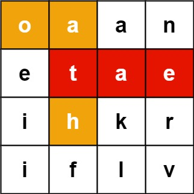
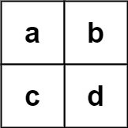

---
tags:
    - Array
    - String
    - Backtracking
    - Trie
    - Matrix
    - Google
    - Top Interviews
---

# [212. Word Search II](https://leetcode.com/problems/word-search-ii/)

Given an `m x n` `board` of characters and a list of strings `words`, return *all words on the board*.

Each word must be constructed from letters of sequentially adjacent cells, where **adjacent cells** are horizontally or vertically neighboring. The same letter cell may not be used more than once in a word.

**Example 1:**



```
Input: board = [["o","a","a","n"],["e","t","a","e"],["i","h","k","r"],["i","f","l","v"]], words = ["oath","pea","eat","rain"]
Output: ["eat","oath"]
```

**Example 2:**



```
Input: board = [["a","b"],["c","d"]], words = ["abcb"]
Output: []
```


**Solution:**

```java
class Solution {
    static class TrieNode{
        Map<Character, TrieNode> children = new HashMap<>();
        boolean isWord = false;
    }

    static class Trie{
        TrieNode root;
        Trie(){
            root = new TrieNode();
        }

        public void insert(String word){
            TrieNode cur = root;
            for (char c : word.toCharArray()){
                cur.children.putIfAbsent(c, new TrieNode());
                cur = cur.children.get(c);
            }
            cur.isWord = true;
        }
    }
    
    int n;
    int m;
    public List<String> findWords(char[][] board, String[] words) {
        List<String> result = new ArrayList<>();

        Trie trie = new Trie();

        for (String word : words){
            trie.insert(word);
        }

        n = board.length;
        m = board[0].length;

        boolean[][] visited = new boolean[n][m];

        StringBuilder sb = new StringBuilder();

        for (int i = 0; i < n; i++){
            for (int j = 0; j < m; j++){
                dfs(board, i, j, trie.root, sb, result, visited);
            }
        }

        return result;
    }

    private void dfs(char[][] board, int x, int y, TrieNode node, StringBuilder sb, List<String> result, boolean[][] visited){
        if (x < 0 || x >= n || y < 0 || y >= m || visited[x][y]){
            return;
        }

        char ch = board[x][y];

        if (!node.children.containsKey(ch)){
            return;
        }

        sb.append(ch);
        node = node.children.get(ch);

        if (node.isWord == true){
            result.add(sb.toString());
            node.isWord = false;
        }

        visited[x][y] = true;

        dfs(board, x + 1, y, node, sb, result, visited);
        dfs(board, x - 1, y, node, sb, result, visited);
        dfs(board, x, y + 1, node, sb, result, visited);
        dfs(board, x, y - 1, node, sb, result, visited);

        visited[x][y] = false;
        sb.deleteCharAt(sb.length() - 1);
    }
}
```


```java
class Solution {
    static class TrieNode{
        Map<Character, TrieNode> children = new HashMap<>();
        Boolean isWord = false;

    }

    static class Trie{
        TrieNode root;
        Trie(){
            root = new TrieNode();
        }

        public void insert(String word){
            TrieNode cur = root;
            for (char c : word.toCharArray()){
                cur.children.putIfAbsent(c, new TrieNode());
                cur = cur.children.get(c);
            }
            cur.isWord = true;
        }
    }

    public List<String> findWords(char[][] board, String[] words) {
        List<String> result = new ArrayList<>();

        Trie trie = new Trie();
        for (String word : words){
            trie.insert(word);
        }

        boolean[][] visited = new boolean[board.length][board[0].length];
        StringBuilder sb = new StringBuilder();

        for (int i = 0; i < board.length; i++){
            for (int j = 0; j < board[0].length; j++){
                helper(board, i, j, trie.root, sb, result, visited);
            }
        }

        return result;
    }

    private void helper(char[][] board, int x, int y, TrieNode node, StringBuilder sb, List<String> result, boolean[][] visited){
        int rows = board.length;
        int cols = board[0].length;
        if (x < 0 || x >= rows || y < 0 || y >= cols || visited[x][y]){
            return;
        }

        char ch = board[x][y];

        if (!node.children.containsKey(ch)){
            return;
        }

        sb.append(ch);
        node = node.children.get(ch);

        if (node.isWord == true){
            result.add(sb.toString());
            node.isWord = false; // // 防止重复加入相同单词
        }


        visited[x][y] = true;
        // four directions
        helper(board, x + 1, y, node, sb, result, visited);
        helper(board, x - 1, y, node, sb, result, visited);
        helper(board, x, y + 1, node, sb, result, visited);
        helper(board, x, y - 1, node, sb, result, visited);

        visited[x][y] = false;
        sb.deleteCharAt(sb.length() - 1);
    }
}
```


```java
class Solution {
    public class TrieNode{
        TrieNode[] children = new TrieNode[26];

        boolean isWord = false;
    }

    static final int[][] DIRS = {{1, 0}, {-1, 0}, {0, 1}, {0, -1}};
    int rows;
    int cols;
    public List<String> findWords(char[][] board, String[] words) {
        List<String> result = new ArrayList<String>();


        if (board == null || board.length == 0 || board[0].length == 0|| words == null || words.length == 0){
            return result;
        }

        Set<String> res = new HashSet<String>();

        TrieNode root = buildDict(words);

        rows = board.length;
        cols = board[0].length;

        boolean[][] visited = new boolean[rows][cols];

        StringBuilder sb = new StringBuilder();
        for (int i = 0; i < rows; i++){
            for (int j = 0; j < cols; j++){
                helper(board, i, j, root, sb, visited, res);
            }
        }

        result.addAll(res);

        return result;
        


    }


    private void helper(char[][] board, int x, int y, TrieNode root, StringBuilder sb, boolean[][] visited, Set<String> res){

        if (x < 0 || x >= rows || y < 0 || y >= cols || visited[x][y] == true){
            return;
        }

        char ch = board[x][y];

        if (root.children[ch - 'a'] == null){
            return;
        }

        sb.append(ch);
        root = root.children[ch - 'a'];
        if (root.isWord){
            res.add(sb.toString());
        }

        visited[x][y] = true;

        for (int[] dir : DIRS){
            int neiX = dir[0] + x;
            int neiY = dir[1] + y;
            helper(board, neiX, neiY, root, sb, visited, res);
        }

        visited[x][y] = false;

        sb.deleteCharAt(sb.length() - 1);
        
    }

    private TrieNode buildDict(String[] words){
        TrieNode root = new TrieNode();
        for (String word : words){
            TrieNode cur = root;
            for (int i = 0; i < word.length(); i++){
                TrieNode next = cur.children[word.charAt(i) - 'a'];
                if (next == null){
                    next = new TrieNode();

                    cur.children[word.charAt(i) - 'a'] = next;
                }

                cur = next;
            }

            cur.isWord = true;
        }


        return root;
    }
}

// TC: O(4^(n^2))
// SC: O(n^2)
```


```java
class Solution {
    public class TrieNode{
        TrieNode[] children = new TrieNode[26]; // 字母多的时候用比较好. 
      // 稀疏的话用map
      // An array of size 26, each index -> character, 'c':'c'-'a' =2 
        boolean isWord;
    }
  
  // Time: worst case guarantee O(m)
  // Space: if the trie is dense, since reusing the common prefix as many as 
  // possible, less space required. worst case O(nm), but usually much better than this.


    static final int[][] DIRS = {{-1, 0}, {1, 0}, {0, -1}, {0, 1}};
  // 四个方向
    public List<String> findWords(char[][] board, String[] words) {
      	// 检查边界条件，如果板为空或单词列表为空，则直接返回空的结果列表
        if (board == null || board.length == 0 || board[0] == null || board[0].length == 0 || words == null || words.length == 0){
            return new ArrayList<String>();
        }

        Set<String> res = new HashSet<>(); // 使用一个HashSet res来存储找到的独特单词
        TrieNode root = buildDict(words); 
      // 调用buildDict方法，使用给定的单词构建Trie，并保存根节点
       	int rows = board.length;
        int cols = board[0].length;
        boolean[][] visited = new boolean[rows][cols];
        StringBuilder sb = new StringBuilder();
        for (int i = 0; i < rows; i++){
            for (int j = 0; j < cols; j++){
                helper(board, i, j, root, sb, res, visited);
            }
        }
        return new ArrayList<>(res);

    }

    private TrieNode buildDict(String[] words){
        TrieNode root = new TrieNode(); // 初始化Trie的根节点
        for (String word : words){ // 遍历每个单词，并将它们插入到Trie中
            TrieNode cur = root;
            for (int i = 0; i < word.length(); i++){
                TrieNode next = cur.children[word.charAt(i) - 'a'];
                if (next == null){
                  // 对于每个字符，如果在当前节点的children数组中不存在，就创建一个新的TrieNode
                    next = new TrieNode(); 
                    cur.children[word.charAt(i) - 'a'] = next;
                }
                cur = next;
            }
            cur.isWord = true; // 标记单词的最后一个字符所在节点的isWord为true
        }
        return root;
    }

    private void helper(char[][] board, int x, int y, TrieNode root, StringBuilder sb, Set<String> res, boolean[][] visited){
        int rows = board.length;
        int cols = board[0].length;
        if (x < 0 || x >= rows || y < 0 || y>= cols || visited[x][y]){
            return; // 检查当前位置是否越界或已访问
        }
        
       // 获取当前位置的字符，并检查当前Trie节点的children数组中是否存在对应的子节点
        char ch = board[x][y];
        if (root.children[ch - 'a'] == null){
            return;
        }

        sb.append(ch); // 将字符添加到StringBuilder中
        root = root.children[ch - 'a']; // 更新当前Trie节点为对应的子节点
        if (root.isWord){  // 如果当前节点是一个单词的结束，将StringBuilder中的内容添加到结果集中
            res.add(sb.toString());
        }
      
        visited[x][y] = true; // 标记当前位置为已访问
        for (int[] dir : DIRS){ // 遍历所有方向，并对每个方向递归调用helper方法
            int neiX = dir[0] + x;
            int neiY = dir[1] + y;
            helper(board, neiX, neiY, root, sb, res, visited);
        }
        visited[x][y] = false;
        sb.deleteCharAt(sb.length() - 1); 
      // 将当前位置标记为未访问，并从StringBuilder中移除最后一个字符
    }
}

// TC: O(4^(m*n))
// SC: O(m*n)
```

为什么用到trie？不用trie就要每一次找到一个存在的word（words.contains(crt)?）都要return然后重新找下一个word，而下一个word有可能会用前一个的前几位字母，这里会有大量的浪费，因为每一个word都要跑一次dfs。
而用trie的话，不光是check exist会变得很简单“isWord”，而且once finished the board, I just finish searching, and board could be much smaller.

思路：对每个board letter跑DFS，带着crt trie root。对于每一个letter，往4-way找，并在每一次dfs()里check它的合法性：

- out of bound？
- this letter existing in any word OR: trie？
- visited?
  层数：basecase导致只有m层（m为最长字母数）。
  注意：visited是在一根path上的记录，所以要spit；string builder当然也是；
  不用特殊处理第一层。一开始带着root进DFS，check的pattern和后面的都一样；

**为什么early break？（不用）**

因为每次DFS分叉，意义都是“从当前letter开头往下找”，所以如果这个位置已经找到了所有的word，就可以之后都return true了。所以这么做就需要标记当前找到的word。这个是brute force的做法，因为bruce是word-oriented的。

**solution里为什么要用Set装res？**

因为不这样去重的话，不同起始但相同内容的word就会重复。比如“bob”，“bb”


```java
class Solution {
    class TrieNode{
        TrieNode[] children = new TrieNode[26];
        boolean isWord = false;
    }

    class Trie{
        TrieNode root;

        Trie(){
            this.root = new TrieNode();
        }

        public void insert(String word){
            TrieNode cur = root;
            for (int i = 0; i < word.length(); i++){
                char ch = word.charAt(i);
                TrieNode next = cur.children[ch - 'a'];
                if (next == null){
                    next = new TrieNode();
                    cur.children[ch - 'a'] = next;
                }
                cur = next;
            }

            cur.isWord = true;
        }
    }

    
    public List<String> findWords(char[][] board, String[] words) {
       List<String> result = new ArrayList<>();

       Trie trie = new Trie();

       for (String word : words){
        trie.insert(word);
       } 

       int n = board.length;
       int m = board[0].length;

       boolean[][] visited = new boolean[n][m];

       StringBuilder sb = new StringBuilder();

       for (int i = 0; i < n; i++){
        for (int j = 0; j < m; j++){
            dfs(board, i, j, trie.root, sb, result, visited);
        }
       }

       return result;
    }

    private void dfs(char[][] board, int i, int j, TrieNode node, StringBuilder sb, List<String> result, boolean[][] visited){
        if (i < 0 || i >= board.length || j < 0 || j >= board[0].length || visited[i][j]){
            return;
        }

        char ch = board[i][j];

        if (node.children[ch - 'a'] == null){
            return;
        }

        sb.append(ch);
        node = node.children[ch - 'a'];

        if (node.isWord == true){
            result.add(sb.toString());
            node.isWord = false;
        }

        visited[i][j] = true;

        dfs(board, i + 1, j, node, sb, result, visited);
        dfs(board, i - 1, j, node, sb, result, visited);
        dfs(board, i, j + 1, node, sb, result, visited);
        dfs(board, i, j - 1, node, sb, result, visited);

        visited[i][j] = false;
        sb.deleteCharAt(sb.length() - 1);
    }
}
```

