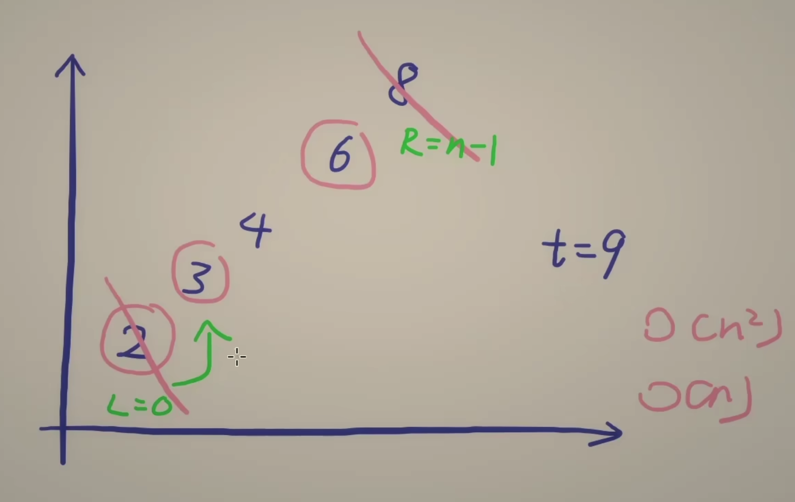

---
tags:
    - Array
    - Two Pointers
    - Binary Search
    - Top Interviews
---

# [167. Two Sum II - Input Array Is Sorted](https://leetcode.com/problems/two-sum-ii-input-array-is-sorted/)

Given a **1-indexed** array of integers `numbers` that is already ***sorted in non-decreasing order\***, find two numbers such that they add up to a specific `target` number. Let these two numbers be `numbers[index1]` and `numbers[index2]` where `1 <= index1 < index2 <= numbers.length`.

Return *the indices of the two numbers,* `index1` *and* `index2`*, **added by one** as an integer array* `[index1, index2]` *of length 2.*

The tests are generated such that there is **exactly one solution**. You **may not** use the same element twice.

Your solution must use only constant extra space.

 

**Example 1:**

```
Input: numbers = [2,7,11,15], target = 9
Output: [1,2]
Explanation: The sum of 2 and 7 is 9. Therefore, index1 = 1, index2 = 2. We return [1, 2].
```

**Example 2:**

```
Input: numbers = [2,3,4], target = 6
Output: [1,3]
Explanation: The sum of 2 and 4 is 6. Therefore index1 = 1, index2 = 3. We return [1, 3].
```

**Example 3:**

```
Input: numbers = [-1,0], target = -1
Output: [1,2]
Explanation: The sum of -1 and 0 is -1. Therefore index1 = 1, index2 = 2. We return [1, 2].
```

 

**Solution**:

```java
class Solution {
    public int[] twoSum(int[] numbers, int target) {
       int n = numbers.length;
       int[] result = new int[2];

       int left = 0;
       int right = n - 1;

       while(left < right){
        int cur = numbers[left] + numbers[right];
        if (cur == target){
            result[0] = left + 1;
            result[1] = right + 1;
            return result;
        }else if (cur < target){
            left++;
        }else{
            right--;
        }
       }
       return result;
    }
}

// TC: O(n)
// SC: O(1)
```


```java
class Solution {
    public int[] twoSum(int[] numbers, int target) {
        int[] result = new int[2];
        int n = numbers.length;
        for (int i = 0; i < n; i++){
            for (int j = i + 1; j < n; j++){
                if (numbers[i] + numbers[j] == target){
                    result[0] = i + 1;
                    result[1] = j + 1;
                    break;
                }
            }
        }
        return result;
    }
}

// TC: O(n^2)
// SC: O(1)

// Time Limit Exceeded
```


```java
class Solution {
    public int[] twoSum(int[] numbers, int target) {
        int[] result = new int[2];
        int n = numbers.length;
        Map<Integer, Integer> map = new HashMap<>();

        for (int i = 0; i < n; i++){
            int cur = numbers[i];
            int need = target - cur;
            if (map.containsKey(need)){
                result[0] = map.get(need) + 1;
                result[1] = i + 1;
                break;
            }else{
                map.put(cur, i);
            }
        }
        return result;
    }
}

// TC: O(n)
// SC: O(n)
```


sorted:

```java
class Solution {
    public int[] twoSum(int[] numbers, int target) {
        int[] result = new int[2];
        int left = 0; 
        int right = numbers.length - 1;
        while(left < right){
            if (numbers[left] + numbers[right] == target){
                result[0] = left+1;
                result[1] = right+1;
                return result;
            }else if (numbers[left] + numbers[right] < target){
                left++;
            }else {
                right--;
            }
        }

        return result;
        
    }
}

// TC: O(n)
// SC: O(1)
```



相向双指针 

